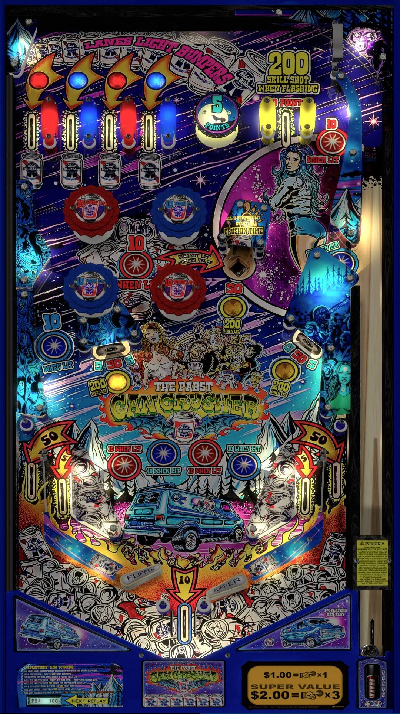

# The Pabst Can Crusher (Stern 2016)

Author: [MachWon](https://vpuniverse.com/profile/70146-machwon/) 

Tested by: Bla1ze 

Version: 1.2.2 

Download: [VP Universe](https://vpuniverse.com/files/file/21020-the-pabst-can-crusher-stern-2016/)

DirectB2S

Author: [hauntfreaks](https://vpuniverse.com/profile/5216-hauntfreaks/) 

Download: [vpuniverse](https://vpuniverse.com/files/file/23810-pabst-can-crusherstern-2016-b2s/)

## Status 

Minimum VPX Standalone build: 10.8.0-1983-a764013
| Playfield | Controls | Backglass | DMD | ROM Required | FPS | 
|-----------|----------|-----------|-----|--------------|-----|
| :white_check_mark: | :white_check_mark: | :white_check_mark: | :x: | :x: | 50 |

## Instructions

- Install this table through the Table Manager, using the `Add Table` > `Manual` page
- If you need help, more information found on the wiki: [TM - Add Table - Manual](https://github.com/LegendsUnchained/vpx-standalone-alp4k/wiki/%5B04%5D-%F0%9F%A7%A1-TM-%E2%80%90-Other-Features#add-table---manual)
- If the table requires any additional files/steps, click `GO TO TABLE` after adding, and the TM will open to the relevant table folder.
- Rename the included "Music Folder" to Music and move the contents to vpx-pabstcancrusher
- Craft beer? Not here! 🍻

