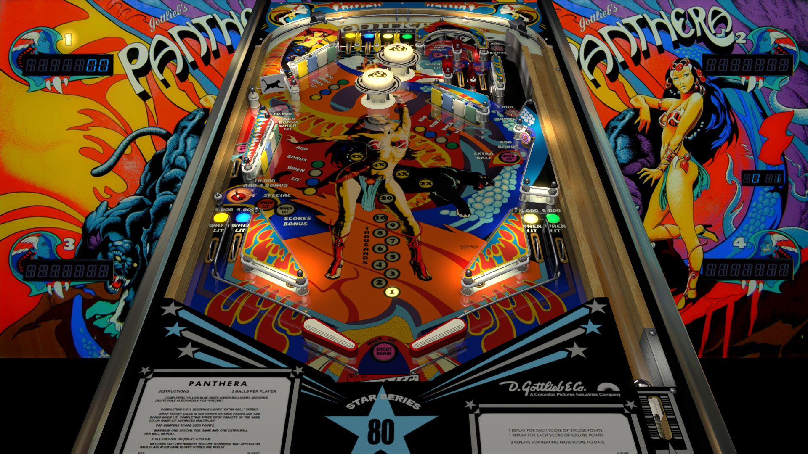

# Panthera (Gottlieb 1980)

Authors: [jpsalas](https://www.vpforums.org/index.php?showuser=277)  
Version: 5.0.5  
Download: [VPUniverse](https://www.vpforums.org/index.php?app=downloads&showfile=13129)

DirectB2S

Authors: [htamas](https://www.vpforums.org/index.php?showuser=16933)  
Download: [VPUniverse](https://www.vpforums.org/index.php?app=downloads&showfile=7545) (use 7 digits))

ROM

ROM Name: panther7.zip  
Download: [Pinball Nirvana](https://pinballnirvana.com/forums/resources/panther7.2147/)

MD5: 5bfff2b4a5b043ff621dee0b42e482a1
SHA1: 1cf92401d9ba9806e616be6d10bdccd87ee676e3

Tested by: Parceval

## Status 

Minimum VPX Standalone build: 10.8.0-2042-1431983

| Playfield | Controls | Backglass | DMD | ROM Required | FPS | 
|-----------|----------|-----------|-----|--------------|-----|
| :white_check_mark: | :white_check_mark: | :white_check_mark: | :x: | :white_check_mark: | 60 |

## Instructions

- Copy the contents of this repo folder to your USB drive
- Add your personalized launcher.elf and rename it to vpx-panthera.elf
- Download the table and directb2s listed above, extract (if necessary) and copy all contents to external/vpx-panthera
- The ROM zip file gets copied to vpx-panthera/pinmame/roms (do not unzip)
- Make sure (.vpx), (.directb2s), and (.ini) files are all named the same
- "Meow"
