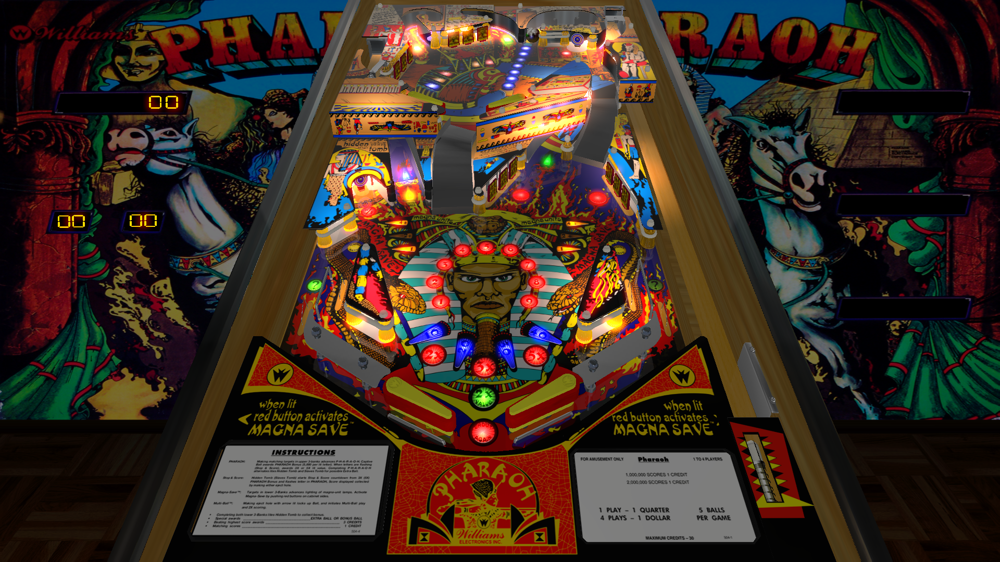

# Pharaoh (Williams 1981)

Authors: [32assassin](https://www.vpforums.org/index.php?showuser=77712)  
Version: 1.0  
Download: [VP Universe](https://www.vpforums.org/index.php?app=downloads&showfile=11724)

DirectB2S

Authors: [Wildman](https://vpuniverse.com/profile/5-wildman/)  
Version: 2.0  
Download: [VP Universe](https://vpuniverse.com/files/file/2216-pharaohwilliams-1981/)

ROM

Authors: [destruk](https://www.vpforums.org/index.php?showuser=5)  
ROM Name: pharo_l2  
Download: [VP Forums](https://www.vpforums.org/index.php?app=downloads&showfile=798)

Tested by: HearForGear

## Status 

Minimum VPX Standalone build: 10.8.0-1989-a764013

| Playfield | Controls | Backglass | DMD | ROM Required | FPS | 
|-----------|----------|-----------|-----|--------------|-----|
| :white_check_mark: | :white_check_mark: | :white_check_mark: | :x: | :white_check_mark: | 49 |

## Instructions

- Copy the contents of this repo folder to your USB drive
- Add your personalized launcher.elf and rename it to vpx-pharaoh.elf
- Download the table and directb2s versions listed above, extract (if necessary) and copy them to external/vpx-pharaoh
- Make sure (.vpx), (.directb2s), and (.ini) files are all named the same
- Place pharo_l2.zip ROM in the external/vpx-pharaoh/pinmame/roms folder. *Do Not unzip*!
- "Who dares enter the tomb of the mighty Pharoah?"
