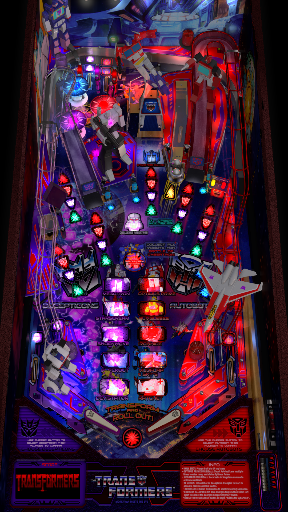

# Pharaoh - Dead Rise

---

## Files
| File Type | Link | Version | Author | 
|-----------|--------|----------|--------------|
| **VPX** | [VP Universe](https://vpuniverse.com/files/file/5673-pharaoh-dead-rise-original-2019/) | 1.1 | [watacaractr](https://vpuniverse.com/profile/5551-watacaractr/) | 
| **B2S** | [VP Universe](https://vpuniverse.com/files/file/5674-pharaoh-dead-rise-2-3-screen-directb2s/) | 1.0| [watacaractr](https://vpuniverse.com/profile/5551-watacaractr/) |
| **DMD** | - | - | - |
| **ROM** | [VP Forums](https://www.vpforums.org/index.php?app=downloads&showfile=798) | pharo_l2.zip | [destruk](https://www.vpforums.org/index.php?showuser=5) |

**Tested by:** [Bla1ze]

---

## Status 
**Minimum VPX Standalone build:** 10.8.0-1983-b84441e
| Playfield | Controls | Backglass | DMD | ROM Required | FPS | 
|-----------|----------|-----------|-----|--------------|-----|
| :white_check_mark: | :white_check_mark: | :white_check_mark: | :x: | :white_check_mark: | 60 |

---

## Instructions
- Copy the contents of this repo folder to your USB drive
- Add your personalized launcher.elf and rename it to vpx-pharoahdr.elf
- Download the table, ROM and directb2s versions listed above and copy them into this folder
- Make sure (.vpx), (.directb2s), and (.ini) files are all named the same
- Place ROM zip file into vpx-pharoahdr/pinmame/roms folder. DO NOT UNZIP!
- Do you dare enter the Mighty Pharaoh's tomb?
