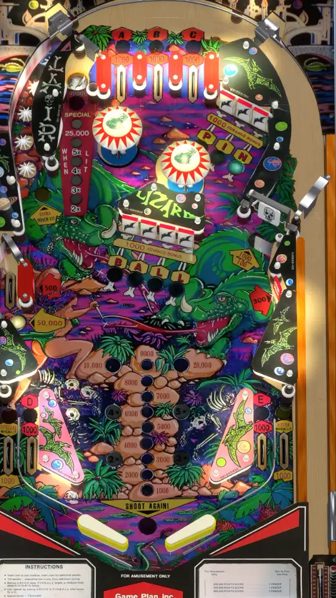

# Pinball Lizard (Game Plan 1980)

---

## Files
| File Type | Link | Version | Author(s) | 
|-----------|--------|----------|--------------|
| **VPX** | [vpforums](https://www.vpforums.org/index.php?app=downloads&showfile=18251) | 1.0.2 | Hmueck, MaX, LuvThatApex |
| **B2S** | [vpuniverse](https://vpuniverse.com/files/file/26101-pinball-lizard-game-plan-1980-b2s/) | 1.0.0 | Hauntfreaks |
| **ROM** | [vpforums](https://www.vpforums.org/index.php?app=downloads&showfile=537) | lizard | Destruk |
| **SERUM** | [N/A](#) | N/A | N/A |
| **PUPPACK** | [N/A](#) | N/A | N/A |

**Tested by:** Curt

---

## Status 

| Backglass | DMD | ROM Required | Has Puppack | FPS |
|-----------|-----|-----|-----|-----|
| ✅ | ✅ | ✅ | ❌ | 60 |

---

## Instructions

- Install this table through the Table Manager, using the `Add Table` > `Manual` page
- If you need help, more information can be found on the wiki: [TM - Add Table - Manual](https://github.com/LegendsUnchained/vpx-standalone-alp4k/wiki/%5B04%5D-%F0%9F%A7%A1-TM-%E2%80%90-Other-Features#add-table---manual)
- If the table requires any additional files/steps, click `GO TO TABLE` after adding, and the TM will open to the relevant table folder.
- 'Earth Shaking Footsteps'
