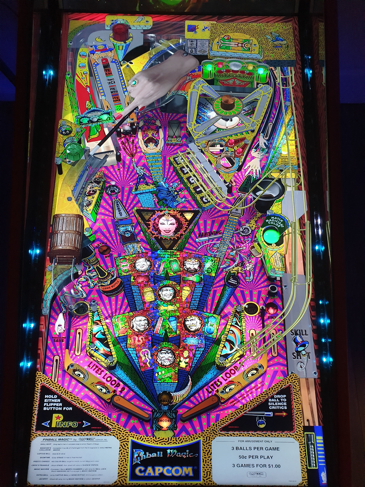

# Pinball Magic (Capcom 1995)

Authors: [Balutito](https://vpuniverse.com/profile/36070-balutito/)  
Version: 1.2  
Download: [vpuniverse](https://vpuniverse.com/files/file/9831-pinball-magic-balutito-reskin/)

DirectB2S

Authors: [hauntfreaks](https://vpuniverse.com/profile/5216-hauntfreaks/)  
Version: 1.0.0  
Download: [vpuniverse](https://vpuniverse.com/files/file/12910-pinball-magic-capcom-1995-b2s-with-full-dmd/)

ROM

Download: [vpforums](https://www.vpforums.org/index.php?app=downloads&showfile=410)  
ROM Name and version: pmv112.zip

## Status 

Minimum VPX Standalone build: 10.8.0-1989-a764013

| Playfield | Controls | Backglass | DMD | ROM Required | FPS | 
|-----------|----------|-----------|-----|--------------|-----|
| :white_check_mark: | :white_check_mark: | :white_check_mark: | :white_check_mark: | :white_check_mark: | 43 |

## Instructions

- Install this table through the Table Manager, using the `Add Table` > `Manual` page
- If you need help, more information found on the wiki: [TM - Add Table - Manual](https://github.com/LegendsUnchained/vpx-standalone-alp4k/wiki/%5B04%5D-%F0%9F%A7%A1-TM-%E2%80%90-Other-Features#add-table---manual)
- If the table requires any additional files/steps, click `GO TO TABLE` after adding, and the TM will open to the relevant table folder.
- "Feast your eyes on the amazing, floating, disappearing, flying pinball!"

