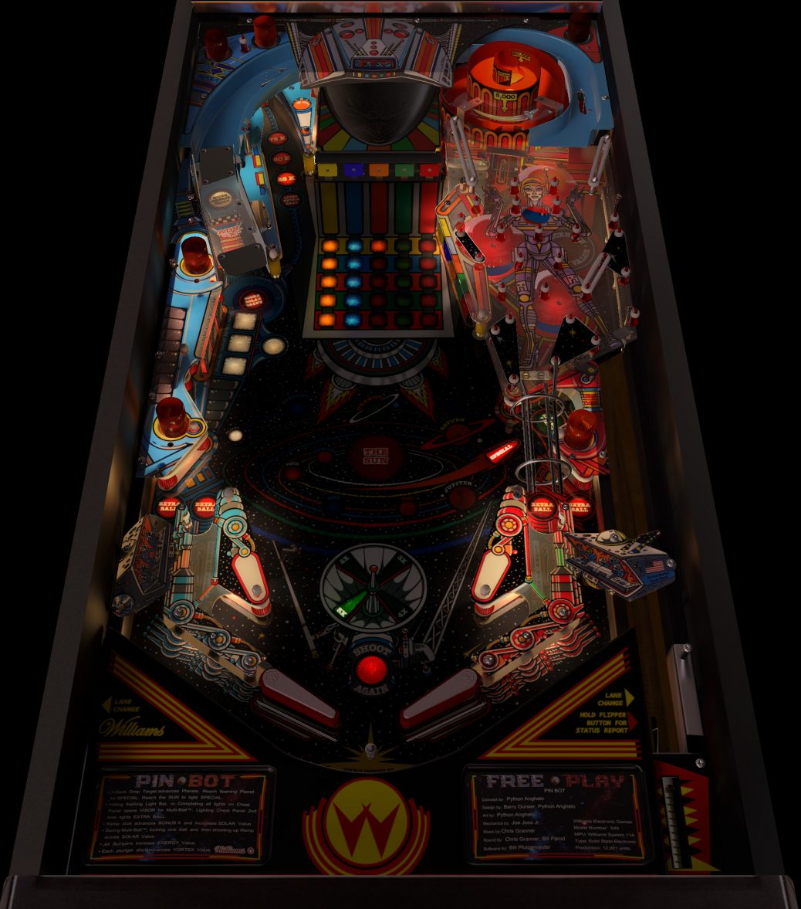

# Pin-Bot (Williams 1986)

Authors: [bord](https://vpuniverse.com/profile/9265-bord/)  
Version: 2.1.1 / 211309852_Pinbot(Williams1986)2.1.1VR.zip
Download: [VPUniverse](https://vpuniverse.com/files/file/6116-pin-bot-williams-1986/)

DirectB2S

Authors: [blacksad](https://vpuniverse.com/profile/9127-blacksad/)
Download: Included in table zip above.

ROM

Version: 1.0  
Download: [VP Forums](https://www.vpforums.org/index.php?app=downloads&showfile=898)

## Status 

Minimum VPX Standalone build: 10.8.0-2006-6d603fb

| Playfield | Controls | Backglass | DMD | ROM Required | FPS | 
|-----------|----------|-----------|-----|--------------|-----|
| :white_check_mark: | :white_check_mark: | :white_check_mark: | :white_check_mark: | :white_check_mark: | 33 |

## Instructions

- Copy the contents of this repo folder to your USB drive
- Add your personalized launcher.elf and rename it to vpx-pinbot.elf
- Download the table and directb2s versions listed above, extract and copy them into /external/vpx-pinbot
- Make sure (.vpx), (.directb2s), (.ini) and (.vbs) files are all named the same
- Downoad the ROM and copy the original non-extracted zip file to vpx-pinbot/pinmame/roms folder
