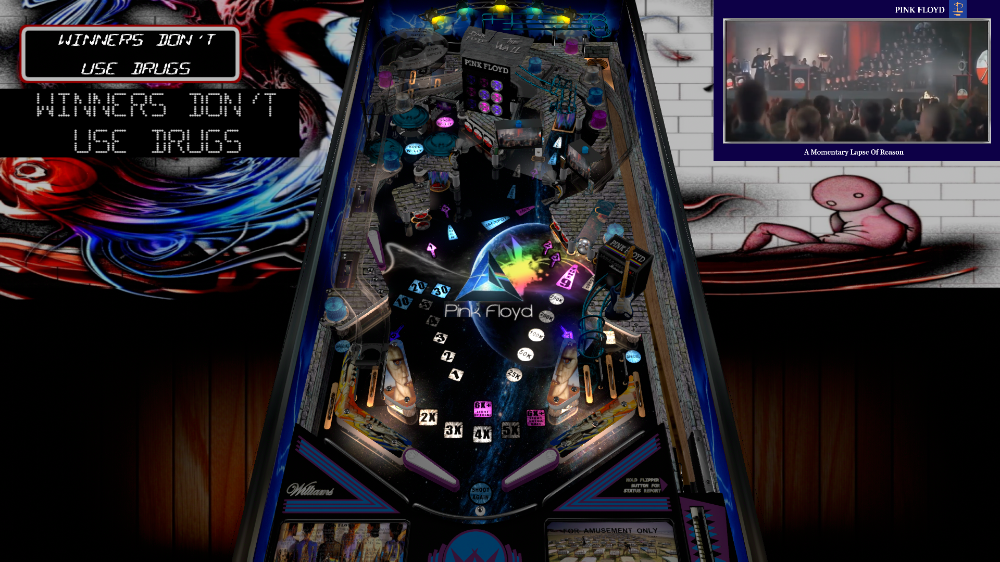

# Pink Floyd (Original 2022)

 

## *️⃣  Table Statistics

| Playfield | Controls | Backglass | DMD | ROM Required | FPS | 
|-----------|----------|-----------|-----|--------------|-----|
| :white_check_mark: | :white_check_mark: | :white_check_mark: | :white_check_mark: | :white_check_mark: | 42 |

 

## ⚠️ Warning

There is a known bug on this table, sometimes the ball gets stuck on the right ramp. 
There isn't really anything that can be done about it. But it doesn't happen too often.

 

**VPXS 4KP Testers:**
  - TechZombie
  - Sscorpio
  - CoffeeAtJoes

 

---

 

## ❇️ Available in the Wizard! 🪄✨

 

This table is available through the Table Manager Wizard, which makes installation quick and easy!

### How to install:

1.  Open the **Table Manager**
2.  Click the **Add Table** button
3.  Select the **Wizard** tab
4.  Find and select this table from the dropdown menu: **`Pink Floyd`**
5.  Follow the on-screen instructions to download and upload the required files
6. *'If ya don't eat yer meat, you can't have any pudding! How can ya have any pudding if ya don't eat ya meat?' - Teacher*

 

Using the Wizard ensures you get the latest table version, have all required files (ROM, backglass, etc.), and have all the VPXS 4KP team's table tweaks and improvements!

 

__*We hope you enjoy!!*__

*The VPXS 4KP Wizard team:*
<pre>
- n-i-x            - Mox              - Lloydbraun
- Boris Undead     - 'Coffee' Joe     - Ominous Osie 🌸
- Bla1ze           - evilwraith       - Silentkat        
- mrandromeda      - SScorpio         - pointdablame
</pre>

 
 
 
 
 
