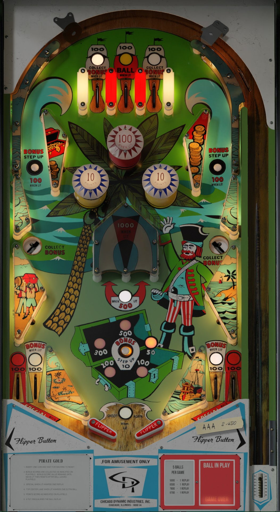

# Pirate Gold (Chicago Coin 1969)

Authors: [Scottacus](https://vpuniverse.com/profile/11566-scottacus/)  
Version: 2.05  
Download: [VP Universe](https://vpuniverse.com/files/file/10866-pirate-gold-chicago-coin-1969/)

DirectB2S
Download: INCLUDED IN TABLE DOWNLOAD  

Tested by: Boris

## Status 

Minimum VPX Standalone build: 10.8.0-1989-a764013

| Playfield | Controls | Backglass | DMD | ROM Required | FPS | 
|-----------|----------|-----------|-----|--------------|-----|
| :white_check_mark: | :white_check_mark: | :white_check_mark: | :x: | :x: | 42 |

## Instructions

- Make sure to use the Table Manager to install this table.
- Instructions can be found on the wiki [Add Table - Manual](https://github.com/LegendsUnchained/vpx-standalone-alp4k/wiki/%5B04%5D-%F0%9F%A7%A1-TM-%E2%80%90-Other-Features#add-table---manual)
- If the table requires any additional files/steps, click `GO TO TABLE` after adding, and the TM will open to the relevant table folder.
- Yo Ho! Yo Ho! A pirate's life for me!

