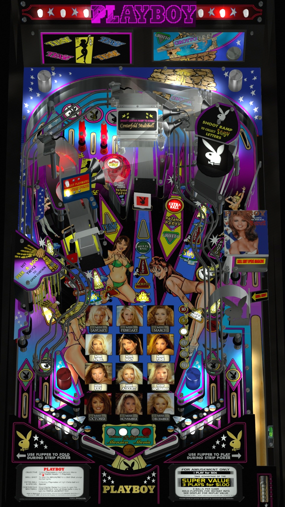

# Playboy (Stern 2002)

Authors: [HiRez00](https://vpuniverse.com/profile/19941-hirez00/)
Version: 1.1
Download: [VP Universe](https://vpuniverse.com/files/file/8359-playboy-stern-2002/)

DirectB2S

Authors: [hauntfreaks](https://vpuniverse.com/profile/5216-hauntfreaks/)
Version: 1.0
Download: [VP Universe](https://vpuniverse.com/files/file/13958-playboy-stern-2002-b2s/)

ROM

Download: [VP Forums](https://www.vpforums.org/index.php?app=downloads&showfile=1120)

Color DMD

Author: [Boroka](https://vpuniverse.com/profile/56302-boroka/)
Download: [VP Universe](https://vpuniverse.com/files/file/19326-playboy-stern-2002-serum-colorization/)
Place the .cRZ file "external\vpx-playboy2002\pinmame\altcolor\playboys" (create the folders if needed)

## Status 

Minimum VPX Standalone build: 10.8.0-1989-a764013
| Playfield | Controls | Backglass | DMD | ROM Required | FPS | 
|-----------|----------|-----------|-----|--------------|-----|
| :white_check_mark: | :white_check_mark: | :white_check_mark: | :white_check_mark: | :white_check_mark: | 48 |

## Instructions

- Copy the contents of this repo folder to your USB drive
- Add your personalized launcher.elf and rename it to vpx-playboy2002.elf
- Download the table and directb2s versions listed above and copy them into this folder