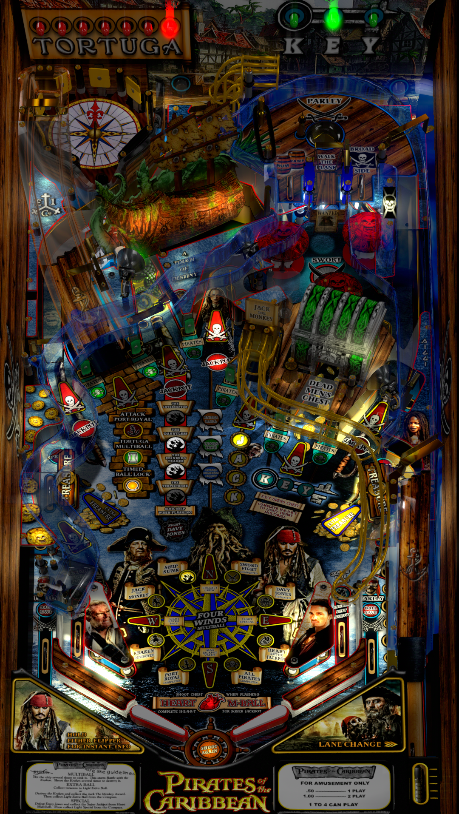

# Pirates of the Caribbean (Siggis Mod) (Stern 2006)

Author: [Siggi](https://vpuniverse.com/profile/8779-siggi/)  
Version: 1.0.0  
Download: [VP Universe](https://vpuniverse.com/files/file/8625-pirates-of-the-caribbean-siggis-mod/)

DirectB2S

Author: [ryguy417](https://vpuniverse.com/profile/31096-ryguy417/)  
Download: [VP Universe](https://vpuniverse.com/files/file/13656-pirates-of-the-caribbean-stern-2006-b2s-with-full-dmd/)
Version: 1.0.0

ROM

Download: [VP Universe](https://vpuniverse.com/files/file/3282-pirates-of-the-caribbean-v60-english-spanish/)  

SHA: fd41e00c9a14131072e0c8f3341f7bd9072c921c  
MD5: 7f2c8108d34a861aa565b70377adfbdf

Tested by: Bla1ze

## Status 

Minimum VPX Standalone build: 10.8.0-1983-a764013

| Playfield | Controls | Backglass | DMD | FPS | 
|-----------|----------|-----------|-----|----------|
| :white_check_mark: | :white_check_mark: | :white_check_mark: | :white_check_mark: | 45 |

## Instructions

- Copy the contents of this repo folder to your USB drive
- Add your personalized launcher.elf and rename it to vpx-potc.elf
- Download the table and directb2s versions listed above, extract (if necessary) and copy them to external/vpx-potc
- Make sure (.vpx), (.directb2s), and (.ini) files are all named the same
- Place ROM zip file into vpx-potc/pinmame/roms folder. DO NOT UNZIP!
- Yes... But.. why is the rum all gone?
