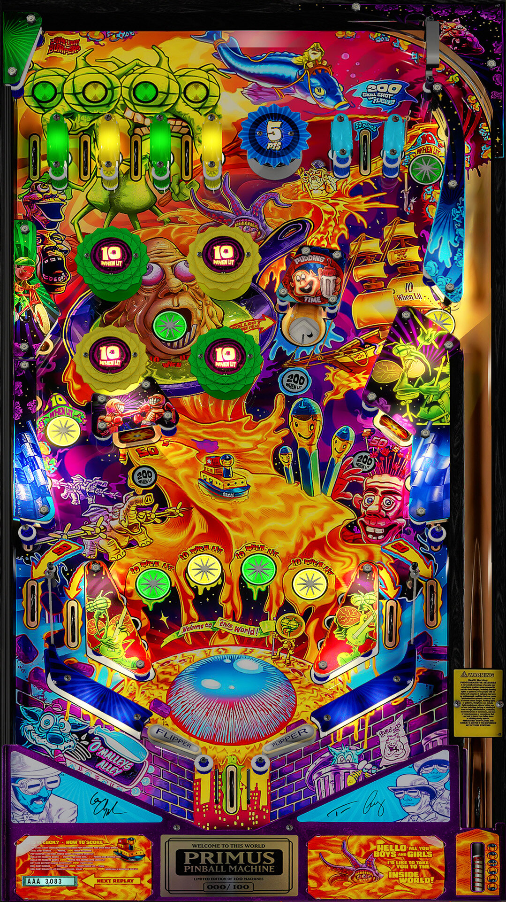

# Primus (Stern 2018)

---

## Files
| File Type | Link | Version | Author | 
|-----------|--------|----------|--------------|
| **VPX** | [vpuniverse](https://vpuniverse.com/files/file/23528-primus-stern-2018-mw-mod/) | 1.21 | [machwon](https://vpuniverse.com/profile/70146-machwon/) |
| **B2S** | [vpuniverse](https://vpuniverse.com/files/file/23565-primus-stern-2018-b2s/) | 1.0 | [hauntfreaks](https://vpuniverse.com/profile/5216-hauntfreaks/) |

**Tested by:** [OminousOsie]

---

## Status 
**Minimum VPX Standalone build:** 10.8.0-1431983

| Playfield | Controls | Backglass | DMD | ROM Required | FPS | 
|-----------|----------|-----------|-----|--------------|-----|
| :white_check_mark: | :white_check_mark: | :white_check_mark: | :x: | :x: | 47 |

---

## Instructions

- Install this table through the Table Manager, using the `Add Table` > `Manual` page
- If you need help, more information found on the wiki: [TM - Add Table - Manual](https://github.com/LegendsUnchained/vpx-standalone-alp4k/wiki/%5B04%5D-%F0%9F%A7%A1-TM-%E2%80%90-Other-Features#add-table---manual)
- If the table requires any additional files/steps, click `GO TO TABLE` after adding, and the TM will open to the relevant table folder.
- Add a 'music' folder in `external/vpx-primus`, and then copy paste the 'primus' folder from the 'Add Folder to Music' folder in 'Primus (Stern 2018) 1.21 Mod.zip' there.

