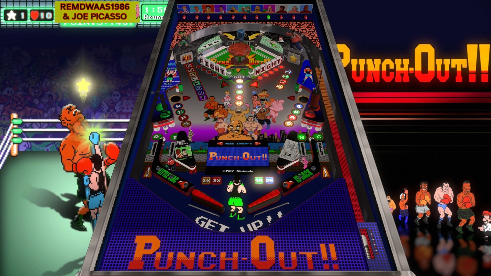

# Punch Out (Original 2025)

---

## Files
| File Type | Link | Version | Author | 
|-----------|--------|----------|--------------|
| **VPX** | [VPUniverse](https://vpuniverse.com/files/file/23522-punchout/) | 1.0.0 | [remdwaas1986](https://vpuniverse.com/profile/28048-remdwaas1986/) |
| **B2S** | [VPUniverse](https://vpuniverse.com/files/file/23522-punchout/) | 1.0.0 |[remdwaas1986](https://vpuniverse.com/profile/28048-remdwaas1986/) |
| **DMD** | N/A | N/A | N/A |
| **ROM** | N/A | N/A | N/A |

**Tested by:** [Bla1ze]

---

## Status

**Minimum VPX Standalone build:** 10.8.0-1983-b84441e

| Playfield | Controls | Backglass | DMD | ROM Required | FPS | 
|-----------|----------|-----------|-----|--------------|-----|
| :white_check_mark: | :white_check_mark: | :white_check_mark: | :white_check_mark: | :x: | 60 |

---

## Instructions

- Make sure to use the Table Manager to install this table.
- Instructions can be found on the wiki [Add Table - Manual](https://github.com/LegendsUnchained/vpx-standalone-alp4k/wiki/%5B04%5D-%F0%9F%A7%A1-TM-%E2%80%90-Other-Features#add-table---manual)
- If the table requires any additional files/steps, click `GO TO TABLE` after adding, and the TM will open to the relevant table folder.
- Every one has a plan, until they get punched in the face! 🥊

