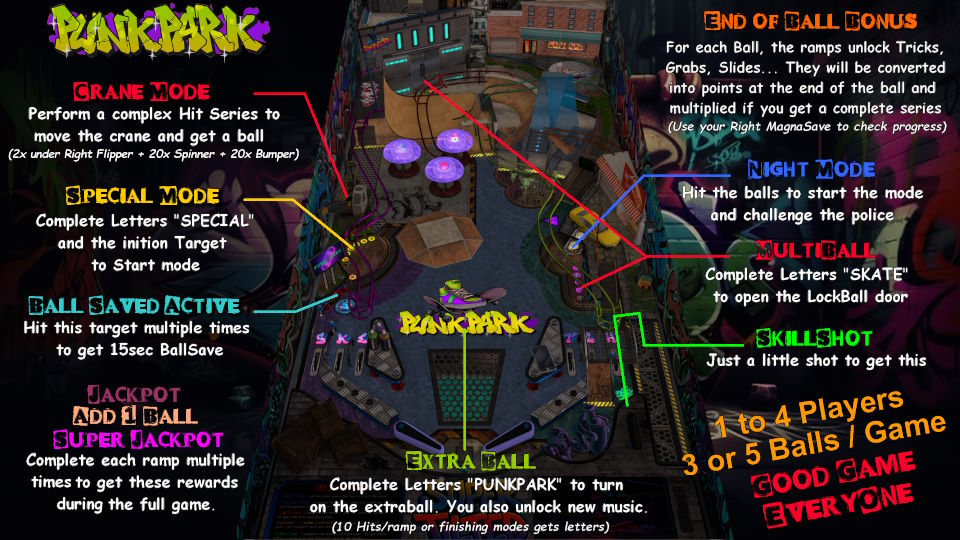

# Punk Park (Original 2025)

---

## Files
| File Type | Link | Version | Author | 
|-----------|--------|----------|--------------|
| **VPX** | [VP Universe](https://vpuniverse.com/files/file/24638-punk-park-original-2025/) | 1.0.2 | [Tombg](https://vpuniverse.com/profile/61082-tombg/) |
| **B2S** | N/A | N/A |
| **DMD** | N/A | N/A |
| **ROM** | N/A | N/A |

**Tested by:** [mrandromeda]

---

## Status 
**Minimum VPX Standalone build:** 10.8.0-5b941e6
| Playfield | Controls | Backglass | DMD | ROM Required | FPS | 
|-----------|----------|-----------|-----|--------------|-----|
| :white_check_mark: | :white_check_mark: | :white_check_mark: | :white_check_mark: | :x: | 43 |

---

## Instructions
- Copy the contents of this repo folder to your USB drive
- Add your personalized launcher.elf and rename it to `vpx-punkpark.elf`
- Download `PunkPark_v1.02.vpx` listed above and it into `vpx-punkpark`
- Make sure `(.vpx)` `(.vbs)` and `(.ini)` are all named the same.
- Download `Media And PupPack.zip` from the same link listed above.
- Create the folder `pupvideos` within the `external/vpx-punkpark`
- Extract the folder `Punk_Park` zip, and put it in the `pupvideos`
- Unzip the `use_these_pup_files.zip` and place them inside the `pupvideos/Punk_Park` folder, and overwrite files if prompted.
- "I won't quit skating until I am physically unable" - Tony Hawk

---

## Info
- Press left direction to change music track.
- Press right direction to display your trick progress.
- Table instructions: https://www.youtube.com/watch?v=Qyie0nZuTSs