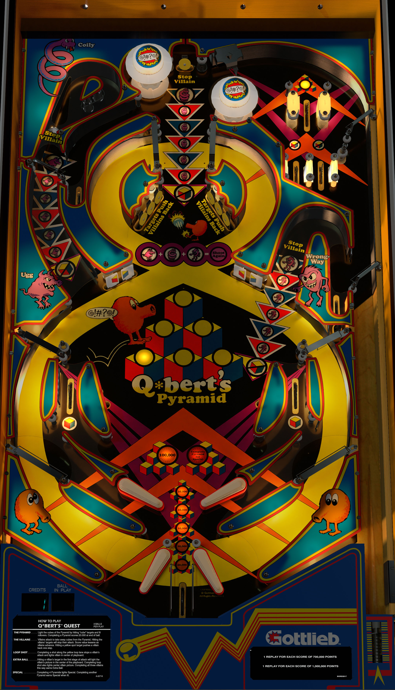

# Q-Bert's Quest (Gottlieb 1983)
Tested By: kaoticBPR

Authors: [bord](https://vpuniverse.com/profile/9265-bord/)
Version: 2.2
Download: [VPUniverse](https://vpuniverse.com/files/file/6364-qberts-quest-gottlieb-1983/?tab=details)

DirectB2S

Authors: [hauntfreaks](https://vpuniverse.com/profile/5216-hauntfreaks/)
Version: 1.0.1
Download: [VPUniverse](https://vpuniverse.com/files/file/6322-qberts-quest-gottlieb-1983/)

ROM

Download: [Pinball Nirvana](https://pinballnirvana.com/forums/resources/qbquest.2205/)
ROM Name and version: qbquest.zip

## Status 

Minimum VPX Standalone build: 10.8.0-1989-a764013
| Playfield | Controls | Backglass | DMD | ROM Required | FPS | 
|-----------|----------|-----------|-----|--------------|-----|
| :white_check_mark: | :white_check_mark: | :white_check_mark: | :white_check_mark: | :white_check_mark: | 42 |

## Instructions

- "Avoid the Super Villians, Change your block colors"

