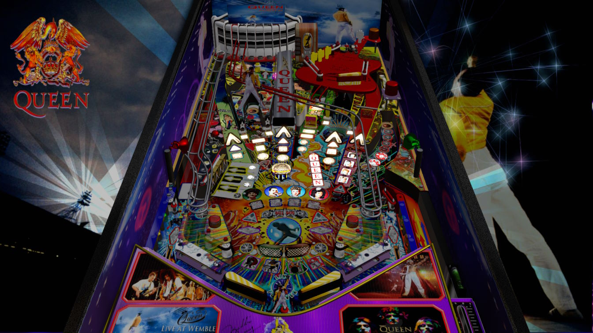

# Queen: Show must go on (Original 2022)

Authors: [Marty02](https://vpuniverse.com/profile/16531-marty02/)  
Version: 3.5  
Download: [VP Universe](https://vpuniverse.com/files/file/11583-queen-show-must-go-on/)

DirectB2S

None

ROM

No Rom Required

## Status 

Minimum VPX Standalone build: 10.8.0-2042-1431983

| Playfield | Controls | Backglass | DMD | ROM Required | FPS | 
|-----------|----------|-----------|-----|--------------|-----|
| :white_check_mark: | :white_check_mark: | :white_check_mark: | :white_check_mark: | :x: | 60 |

---

 

<table>
  <tr>
    <td style="background-color: #FFDDDD; padding: 0; border-left: 4px solid #FF0000;">
      

        <strong>⚠️ WARNING ⚠️</strong>
      

      

        Manually added puppacks are not supported by the VPXS 4KP team We will not be able to help you diagnose issues until this puppack is in the Wizard
      

    </td>
  </tr>
</table>

## Instructions

- Copy the contents of this repo folder to your USB drive.
- Add your personalized launcher.elf and rename it to vpx-queen.elf
- Download the "queen wembley3.5.zip" file and only extract the "Queen show must go on.vpx.vpx" to the vpx-queen folder.
- Make sure (.vpx) (.vbs) and (.ini) are all named the same.
- Extract "Queen show must go on.UltraDMD" folder from the zip to the vpx-queen folder.
- In your vpx-queen folder, create a new folder named music.
- Extract "wembley" folder from the zip into the music folder you created.
- In your vpx-queen folder, create a new folder named pupvideos.
- Extract "Mini pup/QUEEN_original_2022" folder from the zip into the pupvideos folder you created.
- From your vpx-queen folder, unzip the use_these_pup_files.zip and place them inside the pupvideos/QUEEN_original_2022 folder, and overwrite files if prompted.
- When you start a game, before you launch a ball, you can choose your song with the right flipper.
- Enjoy and we will rock you.
