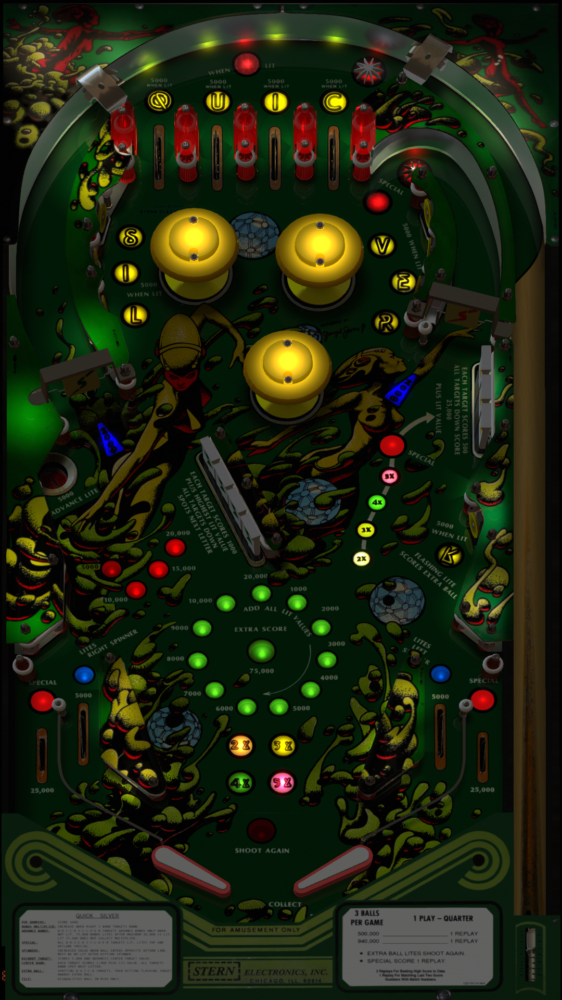

# Quicksilver (Stern 1980)
Tested By: kaoticBPR

.jpg.9805d6c0366021edfdb7d8263765699d.jpg)

Authors: [goldchicco](https://vpuniverse.com/profile/23579-goldchicco/)  
Version: 2.0c  
Download: [VPUniverse](https://vpuniverse.com/files/file/7549-quicksilver-stern-1980/)

DirectB2S

Authors: [Hauntfreaks](https://vpuniverse.com/profile/5216-hauntfreaks/)  
Version: 1.0.0  
Download: [VPUniverse](https://vpuniverse.com/files/file/12446-quicksilver-stern-1980-b2s-with-full-dmd/)

ROM

Download: [vpforums](https://www.vpforums.org/index.php?app=downloads&showfile=743)  
ROM Name and version: quicksil 

## Status 

Minimum VPX Standalone build: 10.8.0-1989-a764013

| Playfield | Controls | Backglass | DMD | ROM Required | FPS | 
|-----------|----------|-----------|-----|--------------|-----|
| :white_check_mark: | :white_check_mark: | :white_check_mark: | :white_check_mark: | :white_check_mark: | 49 |

## Instructions

- Copy the contents of this repo folder to your USB drive
- Add your personalized launcher.elf and rename it to vpx-quicksilver.elf
- Download the table and directb2s versions listed above and copy them into this folder
- Make sure (.vpx), and (.directb2s) files are all named the same
- Place quicksil.zip ROM in the external/vpx-quicksilver/pinmame/roms folder. *Do Not unzip*!

