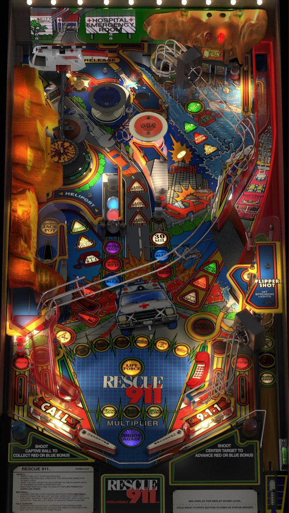

# Rescue 911 (Gottlieb, 1994) 

Author: [antisect](https://vpuniverse.com/profile/36923-antisect/) 

Tested by: Bla1ze

Version: 1.0.0

Download: [VP Universe](https://vpuniverse.com/files/file/7089-rescue-911-gottlieb-1994/)

DirectB2S

Author: [Hauntfreaks](https://vpuniverse.com/profile/5216-hauntfreaks/)  

Version: 1.0.0

Download: [VP Universe](https://vpuniverse.com/files/file/19143-rescue-911-gottlieb-1994-b2s-full-dmd/)

ROM

Download: [Pinball Nirvana](https://pinballnirvana.com/forums/resources/rescu911.3355/)

SHA: 49f2c22645cf78b8cd497fe43643c0f2d31a2c20

MD5: c4897d8d8f2af353a980aae47cd7dafd

## Status 

Minimum VPX Standalone build: 10.8.0-1983-a764013
| Playfield | Controls | Backglass | DMD | ROM Required | FPS | 
|-----------|----------|-----------|-----|--------------|-----|
| :white_check_mark: | :white_check_mark: | :white_check_mark: | :white_check_mark: | :white_check_mark: | 40 |

## Instructions

- Install this table through the Table Manager, using the `Add Table` > `Manual` page
- If you need help, more infomation found on the wiki: [TM - Add Table - Manual](https://github.com/LegendsUnchained/vpx-standalone-alp4k/wiki/%5B04%5D-%F0%9F%A7%A1-TM-%E2%80%90-Other-Features#add-table---manual)
- If the table requires any additional files/steps, click `GO TO TABLE` after adding, and the TM will open to the relevant table folder.
- If you're looking for Shatner, he's not here! 🚑

