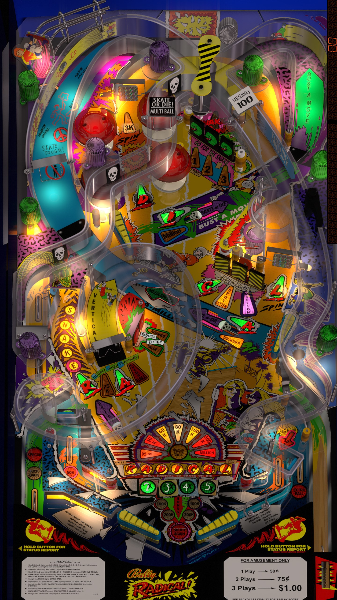

# Radical (Bally 1990)

Author: [jpsalas](https://www.vpforums.org/index.php?showuser=277)  
Version: Radical (Bally 1990) 5.5.0  
Download: [VP Forums](https://www.vpforums.org/index.php?app=downloads&showfile=13694)

DirectB2S

Author: [hauntfreaks](https://vpuniverse.com/profile/5216-hauntfreaks/)  
Version: Radical (Bally 1990) b2s (authentic)  
Download: [VP Universe](https://vpuniverse.com/files/file/10746-radical-bally-1990-b2s-authentic/)

ROM: Radical (L-1)  
Authors: [destruk](https://www.vpforums.org/index.php?showuser=5)  
Version: radcl_l1.zip  
Download: [VP Forums](https://www.vpforums.org/index.php?app=downloads&showfile=951)

Tested by:
[CoffeeAtJoes]

## Status 

Minimum VPX Standalone build: 10.8.0-1983-b84441e

| Playfield | Controls | Backglass | DMD | ROM Required | FPS | 
|-----------|----------|-----------|-----|--------------|-----|
| :white_check_mark: | :white_check_mark: | :white_check_mark: | :x: | :white_check_mark: | 42 |

## Instructions

- Copy the contents of this repo folder to your USB drive
- Add your personalized launcher.elf and rename it to vpx-rad.elf
- Download the table & backglass zips above, extract them and copy them to the /external/vpx-rad folder
- Make sure (.vpx), (.directb2s), and (.ini) files are all named the same
- Place ROM zip file into vpx-rad/pinmame/roms folder. DO NOT UNZIP!
- SKATE! OR! DIE!
