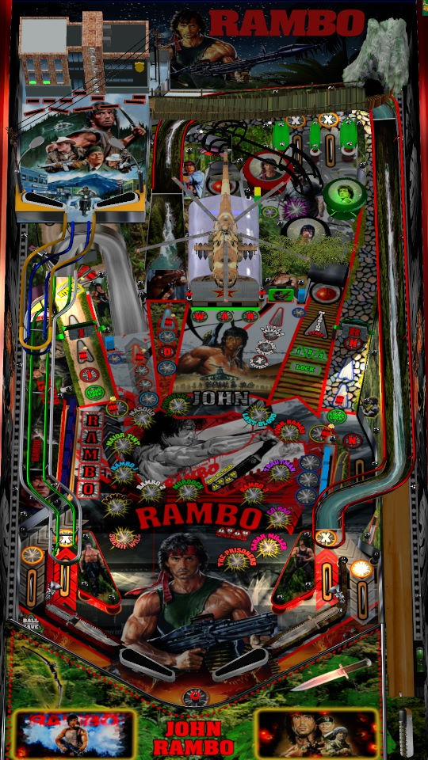

# Rambo: From first to last blood (Original 2025)

---

## Files
| File Type | Link | Version | Author | 
|-----------|--------|----------|--------------|
| **VPX** | [VP Universe](https://vpuniverse.com/files/file/23998-rambo-puppack-table/) | 3.5 | [TeamTuga](https://vpuniverse.com/profile/31843-teamtuga/) |
| **B2S** | N/A | N/A | N/A |
| **DMD** | N/A | N/A | N/A |
| **ROM** | N/A | N/A | N/A |

**Tested by:** [mrandromeda]

---

## Status 
**Minimum VPX Standalone build:** 10.8.0-5b941e6
| Playfield | Controls | Backglass | DMD | ROM Required | FPS | 
|-----------|----------|-----------|-----|--------------|-----|
| :white_check_mark: | :white_check_mark: | :white_check_mark: | :white_check_mark: | :x: | 50 |

---

 

<table>
  <tr>
    <td style="background-color: #FFDDDD; padding: 0; border-left: 4px solid #FF0000;">
      

        <strong>⚠️ WARNING ⚠️</strong>
      

      

        Manually added puppacks are not supported by the VPXS 4KP team 
		We will not be able to help you diagnose issues until this puppack is in the Wizard 
		You can however find a guide here on the wiki to help you install it yourself: <a href="https://github.com/LegendsUnchained/vpx-standalone-alp4k/wiki/%5B08%5D-%E2%9D%A4%EF%B8%8F-Pup-Pack-%E2%80%90-Manual-Install">❤️ Pup Pack ‐ Manual Install</a>
      

    </td>
  </tr>
</table>

## Instructions
- Download from the table link the zips: `RAMBO_720p.rar` and `Rambo_extravideos.rar`
- Create the folder `pupvideos` and extract from `RAMBO_720p.rar` the `Rambo` folder into `pupvideos`. **Do not use the vpx from this archive.**.
- Extract from `Rambo_extravideos.rar` the content from inside the `Rambo_extravideos` folder and place them inside the `pupvideos/Rambo` folder, and overwrite files if prompted.
- Unzip the `use_these_pup_files.zip` and place them inside the `pupvideos/Rambo` folder, and overwrite files if prompted.
- **Do not use the sound fix tool from the table manager, this does not work on this table.**
- "Nothing is over! Nothing!"