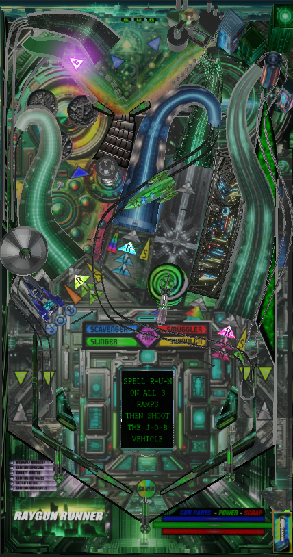

# Raygun Runner (Original 2024)

Authors: [CrimsonTurtle8](https://www.vpforums.org/index.php?showuser=49512)  
Version: 1.0  
Download: [VPForums](https://www.vpforums.org/index.php?app=downloads&showfile=18551)

Backglass:  
Included in table download link

ROM

None

Tested by: evilwraith

## Status 

Minimum VPX Standalone build: 10.8.0-1989-a764013

| Playfield | Controls | Backglass | DMD | ROM Required | FPS | 
|-----------|----------|-----------|-----|--------------|-----|
| :white_check_mark: | :white_check_mark: | :white_check_mark: | :x: | :x: | 60 |

## Instructions

- Copy the contents of this repo folder to your USB drive
- Add your personalized launcher.elf and rename it to vpx-raygunrunner.elf
- Download the table and directb2s listed above, extract (if necessary) and copy to external/vpx-raygunrunner
- Make sure (.vpx), (.directb2s), and (.ini) files are all named the same
- The ROM zip file gets copied to vpx-raygunrunner/pinmame/roms (Do not unzip)
