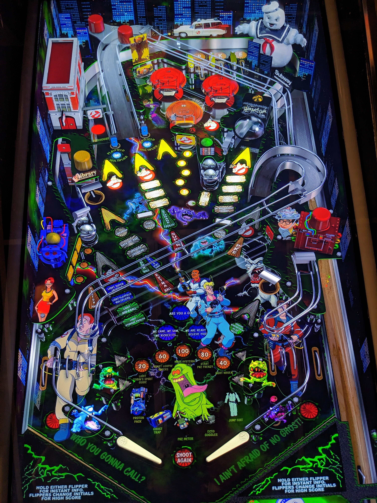

# Real Ghostbusters,The (JPs Ghostbusters mod)

Author(s): [jonpfeiler](https://vpuniverse.com/profile/62585-jonpfeiler/)  
Version:  The Real Ghostbusters.vpx
Download:  [VPUniverse](https://vpuniverse.com/files/file/15645-the-real-ghostbusters-jps-ghostbusters-mod/)

DirectB2S

Version: The Real Ghostbusters.directb2s 

Author(s): [jonpfeiler](https://vpuniverse.com/profile/62585-jonpfeiler/) 
Download:  [VPUniverse](https://vpuniverse.com/files/file/15646-the-real-ghostbusters-b2s-with-full-dmd/)

ROM: **No Rom Needed For This Table**

Tested by:
[TechZombie]

**Warning: This Table Is DARK**

## Status 

Minimum VPX Standalone build: 10.8.0-1983-b84441e
| Playfield | Controls | Backglass | DMD | ROM Required | FPS | 
|-----------|----------|-----------|-----|--------------|-----|
| :white_check_mark: | :white_check_mark: | :white_check_mark: | :white_check_mark: | :x: | 57 |

## Instructions

- Install this table through the Table Manager, using the `Add Table` > `Manual` page
- If you need help, more information found on the wiki: [TM - Add Table - Manual](https://github.com/LegendsUnchained/vpx-standalone-alp4k/wiki/%5B04%5D-%F0%9F%A7%A1-TM-%E2%80%90-Other-Features#add-table---manual)
- If the table requires any additional files/steps, click `GO TO TABLE` after adding, and the TM will open to the relevant table folder.
- "Sometimes I think the universe just waits for me to get cocky!" ---Egon Spengler

