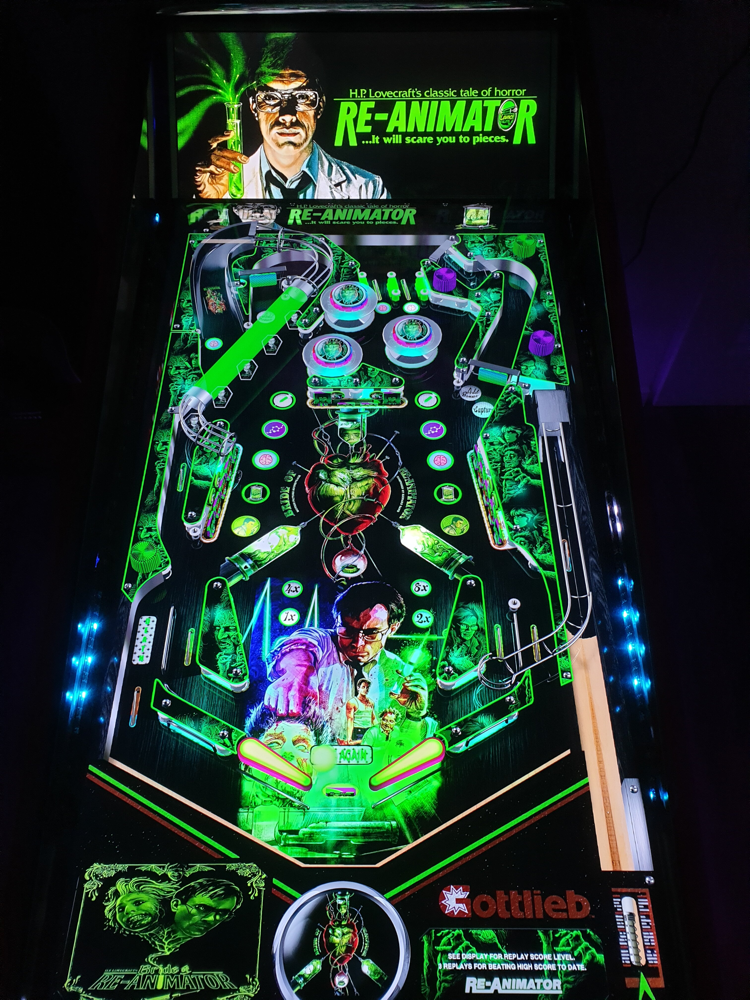

# Re-Animator

Author(s): [balutito](https://vpuniverse.com/profile/36070-balutito/)  
Download: Re-animator.rar  
VPX Version: Re-animator.vpx  
Download:  [VPUniverse](https://vpuniverse.com/files/file/10406-re-animator/)

Author(s): [balutito](https://vpuniverse.com/profile/36070-balutito/) 
DirectB2S included with Table Zip  
Re-animator.directb2s

ROM: diamond.zip  
Included in medias.rar

Author(s): [balutito](https://vpuniverse.com/profile/36070-balutito/)  
Download:  [VPUniverse](https://vpuniverse.com/files/file/10406-re-animator/)

Tested by:
[TechZombie]

## Status 

Minimum VPX Standalone build: 10.8.0-1983-b84441e

| Playfield | Controls | Backglass | DMD | ROM Required | FPS | 
|-----------|----------|-----------|-----|--------------|-----|
| :white_check_mark: | :white_check_mark: | :white_check_mark: | :white_check_mark: | :white_check_mark: | 54 |

## Instructions

- Extract and open (medias.rar), place Music folder into vpx-reanimator
- "Who's going to believe a talking head? Get a job in a sideshow." ---Herbert West

