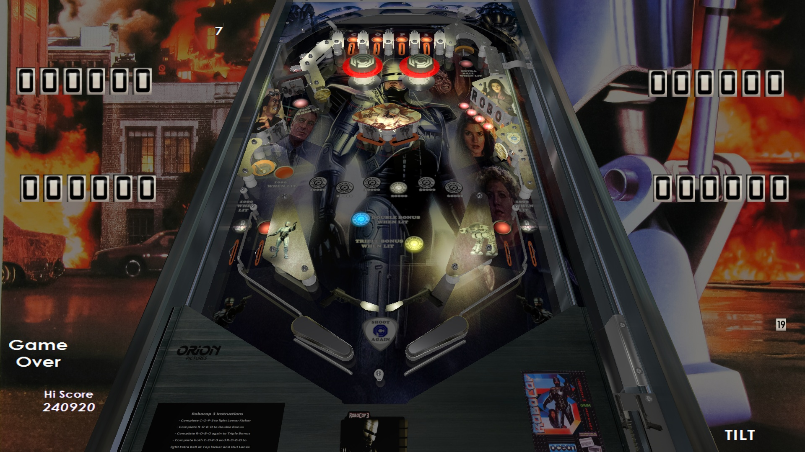

# RoboCop 3 (Original 2018)

---

## Files
| File Type | Link | Version | Author | 
|-----------|--------|----------|--------------|
| **VPX** | [VP Forums](https://www.vpforums.org/index.php?app=downloads&showfile=13947) | 1.0 | [ivantba](https://www.vpforums.org/index.php?showuser=123858) |
| **B2S** | Included with VPX file | 1.0 | [ivantba](https://www.vpforums.org/index.php?showuser=123858) |

**Tested by:** [pointdablame]

---

## Status 
**Minimum VPX Standalone build:** 10.8.0-2042-1431983

| Playfield | Controls | Backglass | DMD | ROM Required | FPS | 
|-----------|----------|-----------|-----|--------------|-----|
| :white_check_mark: | :white_check_mark: | :white_check_mark: | :x: | :x: | 60 |

---

## Instructions

- Copy the contents of this repo folder to your USB drive
- Add your personalized launcher.elf and rename it to `vpx-robocop3.elf`
- Download the table and directb2s versions listed above, extract (if necessary) and copy them into `vpx-robocop3`
- Copy the contents of the `Music` folder from the link above into `\external\vpx-robocop3\Music` (create the folder if needed)
- Make sure `(.vpx)` `(.directb2s)` and `(.ini)` are all named the same.
