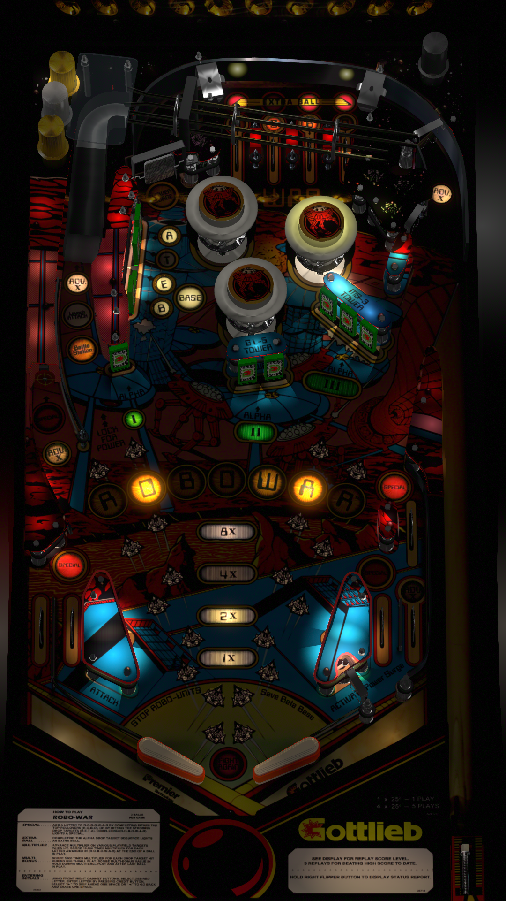

# Robo-War (Gottlieb 1988)

Author: [versins77](https://vpuniverse.com/profile/29661-versins77/)  
Version: 1.0  
Download: [VP Universe](https://vpuniverse.com/files/file/14792-robo-war-premier-1988/)

DirectB2S

Author: [hauntfreaks](https://vpuniverse.com/profile/5216-hauntfreaks/)  
Version: 1.1  
Download: [VP Universe](https://vpuniverse.com/files/file/16411-robo-war-gottlieb-1988-b2s-with-fulldmd/)

ROM

Download: [Pinball Nirvana](https://pinballnirvana.com/forums/resources/robowars.2245/)

## Status 

Minimum VPX Standalone build: 10.8.0-1989-a764013

| Playfield | Controls | Backglass | DMD | ROM Required | FPS | 
|-----------|----------|-----------|-----|--------------|-----|
| :white_check_mark: | :white_check_mark: | :white_check_mark: | :white_check_mark: | :white_check_mark: | 45 |

## Instructions

- Make sure to use the Table Manager to install this table.
- Instructions can be found on the wiki [Add Table - Manual](https://github.com/LegendsUnchained/vpx-standalone-alp4k/wiki/%5B04%5D-%F0%9F%A7%A1-TM-%E2%80%90-Other-Features#add-table---manual)
- If the table requires any additional files/steps, click `GO TO TABLE` after adding, and the TM will open to the relevant table folder.

