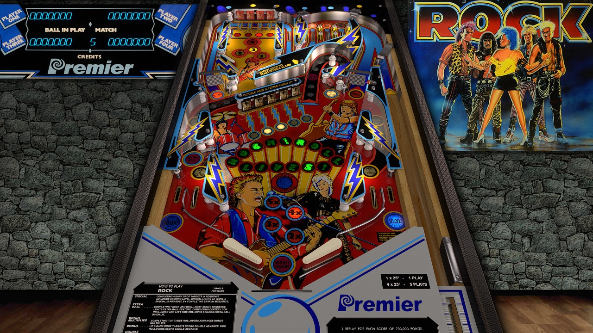

# Rock (Gottlieb 1985)

## Files
| File Type | Link | Version | Author | 
|-----------|--------|----------|--------------|
| **VPX** | [VPForums](https://www.vpforums.org/index.php?app=downloads&showfile=13149) | 5.5.0 | [jpsalas](https://www.vpforums.org/index.php?showuser=277) |
| **B2S** | [VPUniverse](https://vpuniverse.com/files/file/10987-rock-gottlieb-1985-b2s-with-full-dmd/) | 1.0 | [Walterwhite](https://vpuniverse.com/profile/17464-walterwhite/) |
| **DMD** | Not Needed | Not Needed | Not Needed |
| **ROM** | [PinballNirvana](https://pinballnirvana.com/forums/resources/rock.2246/) | 9-8-2022 | [rockola](https://pinballnirvana.com/forums/members/rock-ola.1/) |

**Tested by:** [vicpac73]

---

## Status 
**Minimum VPX Standalone build:** {10.8.0-2042-1431983}

| Playfield | Controls | Backglass | DMD | ROM Required | FPS | 
|-----------|----------|-----------|-----|--------------|-----|
| :white_check_mark: | :white_check_mark: | :white_check_mark: |  :white_check_mark: |  :white_check_mark: | 60 |

---

## Instructions

- Install this table through the Table Manager, using the `Add Table` > `Manual` page
- If you need help, more infomation found on the wiki: [TM - Add Table - Manual](https://github.com/LegendsUnchained/vpx-standalone-alp4k/wiki/%5B04%5D-%F0%9F%A7%A1-TM-%E2%80%90-Other-Features#add-table---manual)
- If the table requires any additional files/steps, click `GO TO TABLE` after adding, and the TM will open to the relevant table folder.

