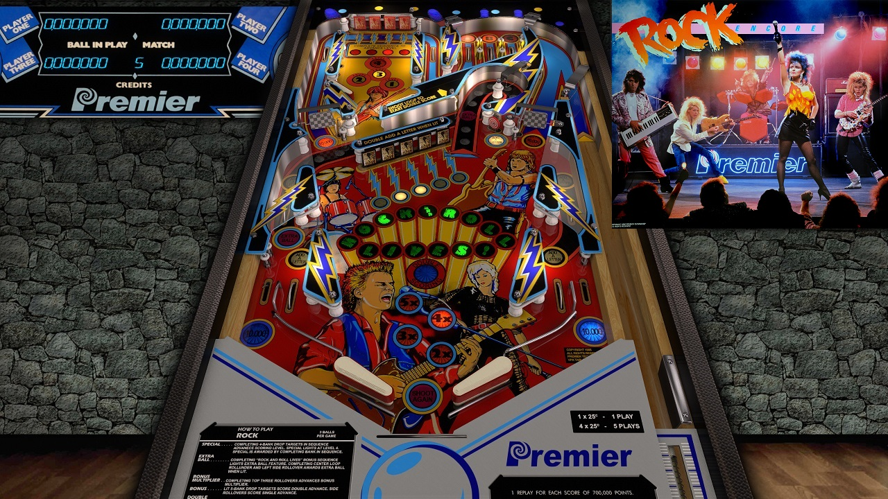

# Rock Encore (Gottlieb 1985)

## Files
| File Type | Link | Version | Author | 
|-----------|--------|----------|--------------|
| **VPX** | [VPForums](https://www.vpforums.org/index.php?app=downloads&showfile=13149) | 5.5.0 | [jpsalas](https://www.vpforums.org/index.php?showuser=277) |
| **B2S** | [VPForums](https://www.vpforums.org/index.php?app=downloads&showfile=13151) | 1.0 | [darquayle](https://www.vpforums.org/index.php?showuser=51255) |
| **DMD** | Not Needed | Not Needed | Not Needed |
| **ROM** | [PinballNirvana](https://pinballnirvana.com/forums/resources/rock_enc.2247/) | 9-8-2022 | [rockola](https://pinballnirvana.com/forums/members/rock-ola.1/) |

**Tested by:** [vicpac73]

---

## Status 
**Minimum VPX Standalone build:** {10.8.0-2042-1431983}

| Playfield | Controls | Backglass | DMD | ROM Required | FPS | 
|-----------|----------|-----------|-----|--------------|-----|
| :white_check_mark: | :white_check_mark: | :white_check_mark: |  :white_check_mark: |  :white_check_mark: | 58 |

---

## Instructions

- Copy the contents of this repo folder to your USB drive
- Add your personalized launcher.elf and rename it to `vpx-rockenc.elf`
- Download the table and directb2s versions listed above, extract (if necessary) and copy them into `external/vpx-rockenc`
- Place ROM zip file into `vpx-rockenc/pinmame/roms` folder. DO NOT UNZIP!
- Make sure `(.vpx)`, `(.vbs)`, `(.directb2s)` and `(.ini)` are all named the same.

