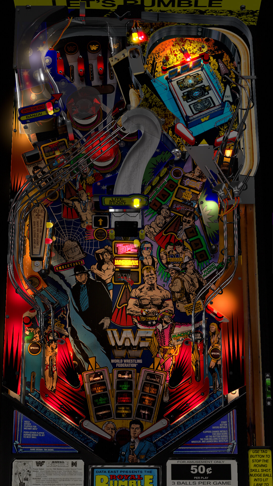

# WWF Royal Rumble (Data East 1994) 

Author: [Hauntfreaks](https://vpuniverse.com/profile/5216-hauntfreaks/)  

Tested by: Bla1ze

Version: 2.03

Download: [VP Universe](https://vpuniverse.com/files/file/7733-wwf-royal-rumble-data-east-1994-3hr-makeover/)

DirectB2S

Author: [Hauntfreaks](https://vpuniverse.com/profile/5216-hauntfreaks/)  

Version: 2.0

Download: [VP Universe](https://vpuniverse.com/files/file/17549-wwf-royal-rumble-data-east-1994-b2s-with-full-dmd/)

ROM

Download: [VP Forums](https://www.vpforums.org/index.php?app=downloads&showfile=865)

SHA: 5f6ab55f2ed5aa82a54b02c56a3394de57c6058a

MD5: 363ce8166104eb8b21897afe67d627ad

## Status 

Minimum VPX Standalone build: 10.8.0-1983-a764013
| Playfield | Controls | Backglass | DMD | ROM Required | FPS | 
|-----------|----------|-----------|-----|--------------|-----|
| :white_check_mark: | :white_check_mark: | :white_check_mark: | :white_check_mark: | :white_check_mark: | 35 |

## Instructions

- Copy the contents of this repo folder to your USB drive
- Add your personalized launcher.elf and rename it to vpx-royalrumble.elf
- Download the table, ROM and directb2s versions listed above and copy them into this folder
- Make sure (.vpx), (.directb2s), (.ini) and (.vbs) files are all named the same
- Place ROM zip file into vpx-royalrumble/pinmame/roms folder. Do NOT unzip!
- "GET BACK INTO THE RING.. IT'S TIME FOR THE WWF ROYAL RUMBLE!"
