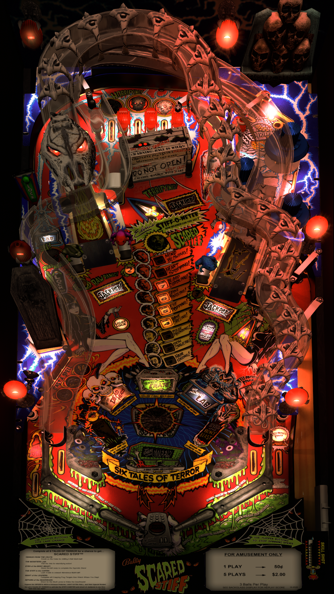

# Scared Stiff (Bally 1996) 

Author: [Mikcab](https://vpuniverse.com/profile/16013-mikcab/)  
Version: 1.29  
Download: [VP Universe](https://vpuniverse.com/files/file/13544-scared-stiff-bally-1996-mikcab_mod/)

DirectB2S

Author: [Hauntfreaks](https://vpuniverse.com/profile/5216-hauntfreaks/)  
Version: 2.0  
Download: [VP Universe](https://vpuniverse.com/files/file/12140-scared-stiff-bally-1996-b2s-with-full-dmd/)

ROM

Download: [VP Forums](https://www.vpforums.org/index.php?app=downloads&showfile=1207)

SHA: b35acfe1162173c72d93f2ed1632b584fa8103ad  
MD5: 6c4a4f2bd3e1e4e2d72065fcaf4b3b9c

Alt Color

Author: [dtatane](https://vpuniverse.com/profile/30013-dtatane/)  
Version: 1.1  
Download: [VP Universe](https://vpuniverse.com/files/file/13489-scared-stiff-bally-1996-dmd-64-colors-serum-format/)

Tested by: Bla1ze

## Status 

Minimum VPX Standalone build: 10.8.0-1983-a764013

| Playfield | Controls | Backglass | DMD | ROM Required | FPS | 
|-----------|----------|-----------|-----|--------------|-----|
| :white_check_mark: | :white_check_mark: | :white_check_mark: | :white_check_mark: | :white_check_mark: | 47 |

## Instructions

- Copy the contents of this repo folder to your USB drive
- Add your personalized launcher.elf and rename it to vpx-scaredstiff.elf
- Download the table and directb2s versions listed above, extract (if necessary) and copy them to external/vpx-scaredstiff
- Make sure (.vpx), (.directb2s), (.ini) and (.vbs) files are all named the same
- Place ROM zip file into vpx-scaredstiff/pinmame/roms folder. DO NOT UNZIP!
- If using the Alt Color, make an "altcolor" folder inside the pinmame folder. Inside the "altcolor" folder, make a "ss_15" folder and place .cRZ file inside
- Turn out the lights... it's time to get Scared Stiff!
