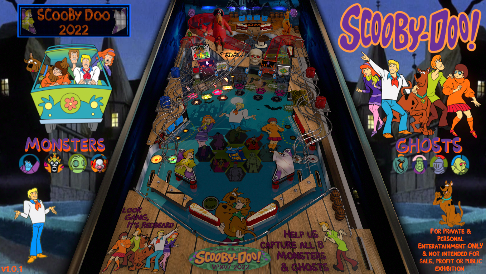

# Scooby Doo (2022) 

Author(s): [mrjcrane](https://www.vpforums.org/index.php?showuser=117777)  
Version: Scooby Doo, 2022 v1.0_04012022  
Download: [VP Forums](https://www.vpforums.org/index.php?app=downloads&showfile=16631)

DirectB2S

Authors: [LoadedWeapon](https://www.vpforums.org/index.php?showuser=60392)  
Version: 1.0.0  
Download: [VP Universe](https://www.vpforums.org/index.php?app=downloads&showfile=16634)

Alternate DirectB2S

Authors: [davadruix](https://www.vpforums.org/index.php?showuser=111417)  
Version: 1.0.0  
Download: [VP Universe](https://www.vpforums.org/index.php?app=downloads&showfile=16654)

ROM:
No ROM Needed

## Status 

Minimum VPX Standalone build: 10.8.0-1983-b84441e  

| Playfield | Controls | Backglass | DMD | ROM Required | FPS | 
|-----------|----------|-----------|-----|--------------|-----|
| :white_check_mark: | :white_check_mark: | :white_check_mark: | :white_check_mark: | :x: | 50 |

## Instructions

- Install this table through the Table Manager, using the `Add Table` > `Manual` page
- If you need help, more infomation found on the wiki: [TM - Add Table - Manual](https://github.com/LegendsUnchained/vpx-standalone-alp4k/wiki/%5B04%5D-%F0%9F%A7%A1-TM-%E2%80%90-Other-Features#add-table---manual)
- If the table requires any additional files/steps, click `GO TO TABLE` after adding, and the TM will open to the relevant table folder.
- "And I would have gotten away with it, too, if it werent for you meddling kids!." --AtGames

