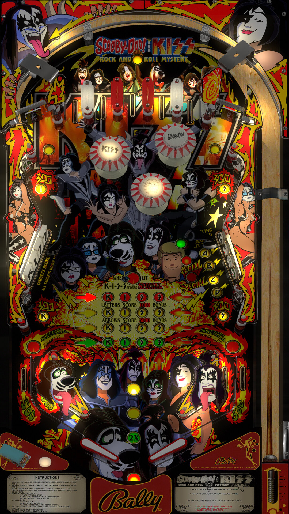

# Scooby Doo! and KISS Rock n' Roll Mystery (Original 2021)

Author(s): [hauntfreaks](https://vpuniverse.com/profile/5216-hauntfreaks/)  
Version:  Scooby Doo! and KISS Rock n' Roll Mystery v2.0  
Download:  [VP Universe](https://vpuniverse.com/files/file/7207-scooby-doo-and-kiss-rock-n-roll-mystery-v20)

DirectB2S

Authors: [hauntfreaks](https://vpuniverse.com/profile/5216-hauntfreaks/)  
Version: Scooby Doo! and KISS Rock n' Roll Mystery v2.0 (b2s)  
Download: [VP Universe](https://vpuniverse.com/files/file/7206-scooby-doo-and-kiss-rock-n-roll-mystery-v20-b2s/)

ROMs: kiss, kissb

INCLUDED IN TABLE DOWNLOAD, REQUIRES BOTH ROMS

Tested by:  
[CoffeeAtJoes & pointdablame]

## Status 

Minimum VPX Standalone build: 10.8.0-1983-b84441e

| Playfield | Controls | Backglass | DMD | ROM Required | FPS | 
|-----------|----------|-----------|-----|--------------|-----|
| :white_check_mark: | :white_check_mark: | :white_check_mark: | :x: | :white_check_mark: | 60 |

## Notes
- DMD on backglass

## Instructions

- Make sure to use the Table Manager to install this table.
- Instructions can be found on the wiki [Add Table - Manual](https://github.com/LegendsUnchained/vpx-standalone-alp4k/wiki/%5B04%5D-%F0%9F%A7%A1-TM-%E2%80%90-Other-Features#add-table---manual)
- If the table requires any additional files/steps, click `GO TO TABLE` after adding, and the TM will open to the relevant table folder.
- Place both ROM zips (kiss.zip & kissb.zip) in the /vpx-sdookiss/pinmame/roms folder. (Do not un-zip!)
- Place the sdookiss folder into the external/vpx-sdookiss/music folder
- Yes, 'Don't Touch My Ascot" is an actual song performed by KISS!

