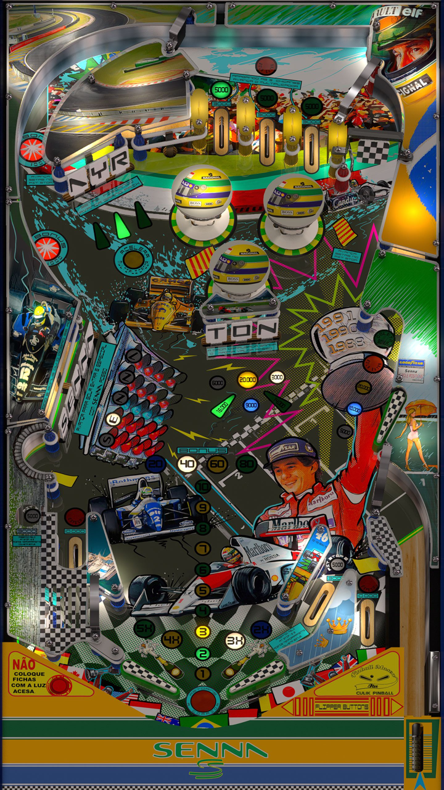

# Senna Prototype Edition (Culik Pinball 2020) 1.0.1 

Authors: [JPsalas](https://www.vpforums.org/index.php?showuser=277)

Tested by: Bla1ze

Version: 1.0.1

Download: [VP Forums](https://www.vpforums.org/index.php?app=downloads&showfile=18570)

DirectB2S

Authors: [Halen](https://www.vpforums.org/index.php?showuser=74)

Version: 1.0.1

Download: [VP Forums](https://www.vpforums.org/index.php?app=downloads&showfile=18570)

ROM

Not Needed

## Status 

Minimum VPX Standalone build: 10.8.0-1989-a764013
| Playfield | Controls | Backglass | DMD | ROM Required | FPS | 
|-----------|----------|-----------|-----|--------------|-----|
| :white_check_mark: | :white_check_mark: | :white_check_mark: | :x: | :x: | 60 |

## Instructions

- Install this table through the Table Manager, using the `Add Table` > `Manual` page
- If you need help, more information found on the wiki: [TM - Add Table - Manual](https://github.com/LegendsUnchained/vpx-standalone-alp4k/wiki/%5B04%5D-%F0%9F%A7%A1-TM-%E2%80%90-Other-Features#add-table---manual)
- If the table requires any additional files/steps, click `GO TO TABLE` after adding, and the TM will open to the relevant table folder.
- “Suddenly I realised that I was no longer driving the car consciously. I was driving it by a kind of instinct, only I was in a different dimension.” - Ayrton Senna

