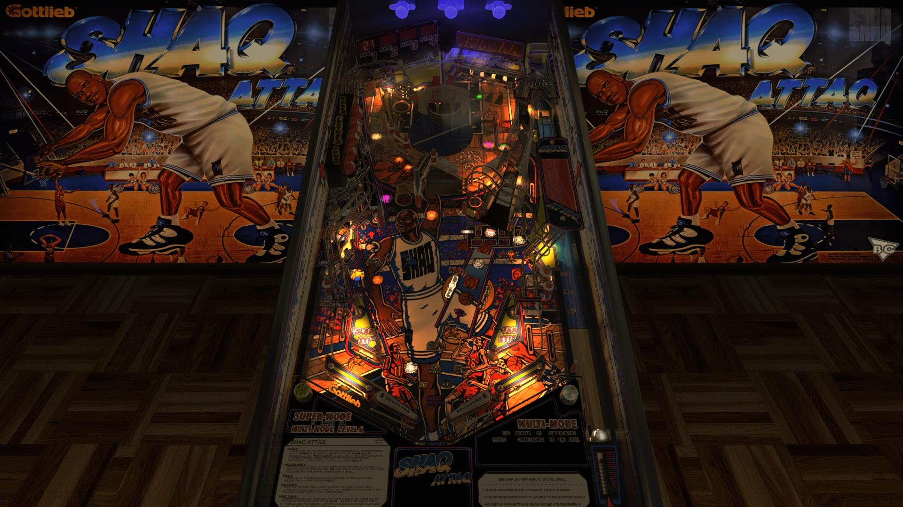

# Shaq Attaq (Gottlieb 1995)

Author: [JLouLoulou](https://www.vpforums.org/index.php?showuser=134330)  
Version: 1.0.1  
Download: [VP Forums](https://www.vpforums.org/index.php?app=downloads&showfile=15362)

DirectB2S

Author: [ryguy417](https://vpuniverse.com/profile/31096-ryguy417/)  
Version: 1.0  
Download: [VP Universe](https://vpuniverse.com/files/file/13150-shaq-attaq-gottlieb-1995-b2s-with-full-dmd/)

ROM

Download: [Pinball Nirvana](https://pinballnirvana.com/forums/resources/shaqatt2.2284/)

## Status 

Minimum VPX Standalone build: 10.8.0-1989-a764013

| Playfield | Controls | Backglass | DMD | ROM Required | FPS | 
|-----------|----------|-----------|-----|--------------|-----|
| :white_check_mark: | :white_check_mark: | :white_check_mark: | :white_check_mark: | :white_check_mark: | 35 |

## Instructions

- Copy the contents of this repo folder to your USB drive
- Add your personalized launcher.elf and rename it to vpx-shaq.elf
- Download the table and directb2s versions listed above, extract and copy them into this folder
- Make sure (.vpx), (.directb2s), and (.ini) files are all named the same
- Place ROM zip file into vpx-shaq/pinmame/roms folder. DO NOT UNZIP!

