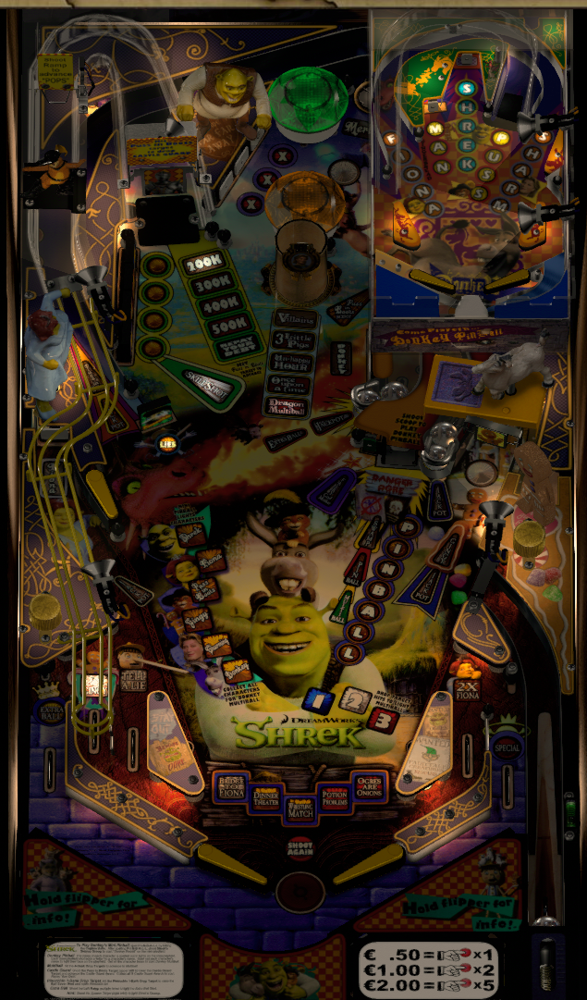

# Shrek (Stern 2008)
Tested by: kaoticBPR

Authors: [paladinarcade](https://vpuniverse.com/profile/38767-paladinarcade/)  
Version: 1.0  
Download: [VPUniverse](https://vpuniverse.com/files/file/11215-shrek-stern-2008mod-10/)

DirectB2S  

Authors: [wildman](https://vpuniverse.com/profile/5-wildman/)  
Version: 3.0  
Download: [VP Universe](https://vpuniverse.com/files/file/2423-shrekstern-2008/)

ROM  

Download: [VPUniverse](https://vpuniverse.com/files/file/3310-shrek-v141/)  
Rom Name: shr_141.zip

## Status 

Minimum VPX Standalone build: 10.8.0-1989-a764013  

| Playfield | Controls | Backglass | DMD | ROM Required | FPS | 
|-----------|----------|-----------|-----|--------------|-----|
| :white_check_mark: | :white_check_mark: | :white_check_mark: | :white_check_mark: | :white_check_mark: | 35 |

## Instructions

- Make sure to use the Table Manager to install this table.
- Instructions can be found on the wiki [Add Table - Manual](https://github.com/LegendsUnchained/vpx-standalone-alp4k/wiki/%5B04%5D-%F0%9F%A7%A1-TM-%E2%80%90-Other-Features#add-table---manual)
- If the table requires any additional files/steps, click `GO TO TABLE` after adding, and the TM will open to the relevant table folder.

