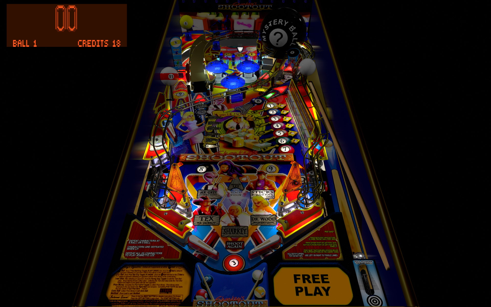

# Sharkey's Shootout (Stern 2000)

Authors: [Bigus](https://www.vpforums.org/index.php?showuser=107629)  
Version: 1.0  
Download: [VPForums](https://www.vpforums.org/index.php?app=downloads&showfile=18616)

DirectB2S

Authors: [hauntfreaks](https://vpuniverse.com/profile/5216-hauntfreaks/)  
Download: [VPUniverse](https://vpuniverse.com/files/file/17147-sharkeys-shootout-stern-2000-b2s-with-full-dmd/)

ROM

ROM Name: shrkysht.zip  
Download: [VPForums](https://www.vpforums.org/index.php?app=downloads&showfile=1105)  

SHA1: 3F7101E675DB79FE31B11B78F9DF5090BAFA754B  
MD5:  4F424C099C9C0687703926C71D17B60D 

Tested by: evilwraith

## Status 

Minimum VPX Standalone build: 10.8.0-1989-a764013

| Playfield | Controls | Backglass | DMD | ROM Required | FPS | 
|-----------|----------|-----------|-----|--------------|-----|
| :white_check_mark: | :white_check_mark: | :white_check_mark: | :white_check_mark: | :white_check_mark: | 45 |

## Instructions

- Install this table through the Table Manager, using the `Add Table` > `Manual` page
- If you need help, more information found on the wiki: [TM - Add Table - Manual](https://github.com/LegendsUnchained/vpx-standalone-alp4k/wiki/%5B04%5D-%F0%9F%A7%A1-TM-%E2%80%90-Other-Features#add-table---manual)
- If the table requires any additional files/steps, click `GO TO TABLE` after adding, and the TM will open to the relevant table folder.

