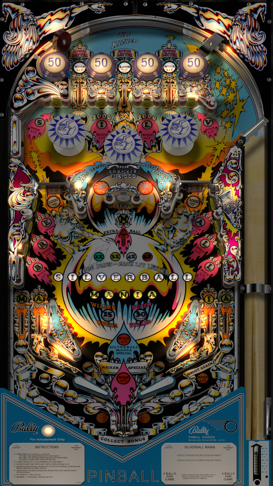

# Silverball Mania (Bally 1978)

Authors: [hauntfreaks](https://vpuniverse.com/profile/5216-hauntfreaks/)
Version: 1.2
Download: [VPUniverse](https://vpuniverse.com/files/file/7284-silverball-mania-bally-1978/)

DirectB2S

Authors: [hauntfreaks](https://vpuniverse.com/profile/5216-hauntfreaks/)
Version: 1.0.0
Download: [VPUniverse](https://vpuniverse.com/files/file/7283-silverball-mania-bally-1978-b2s/)

ROM

Download: [vpforums](https://www.vpforums.org/index.php?app=downloads&showfile=683)
ROM Name and version: slbmanib

## Status 

Minimum VPX Standalone build: 10.8.0-1989-a764013
| Playfield | Controls | Backglass | DMD | ROM Required | FPS | 
|-----------|----------|-----------|-----|--------------|-----|
| :white_check_mark: | :white_check_mark: | :white_check_mark: | :white_check_mark: | :white_check_mark: | 55 |

## Instructions

- Copy the contents of this repo folder to your USB drive
- Add your personalized launcher.elf and rename it to vpx-silverballmania.elf
- Download the table and directb2s versions listed above and copy them into this folder
- Make sure (.vpx), and (.directb2s) files are all named the same
- Place slbmanib.zip ROM in the external/vpx-silverballmania/pinmame/roms folder. *Do Not unzip*!

