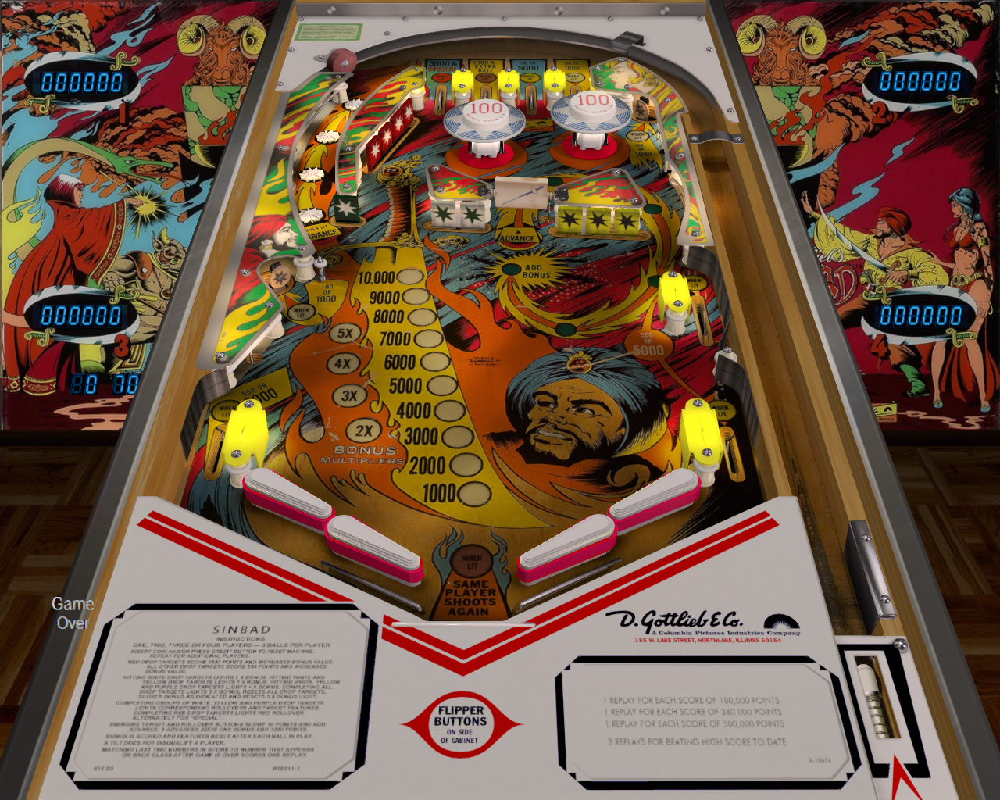

# Sinbad (Gottlieb 1978)

---

## Files
| File Type | Link | Version | Author | 
|-----------|--------|----------|--------------|
| **VPX** | [VPForums](https://www.vpforums.org/index.php?app=downloads&showfile=18338) | 1.2 | [STYX](https://www.vpforums.org/index.php?showuser=62551) |
| **B2S** | [VPUniverse](https://vpuniverse.com/files/file/13519-sinbad-gottlieb-1978-b2s-with-full-dmd/) | 1.0.0 | [ryguy417](https://vpuniverse.com/profile/31096-ryguy417/) |
| **ROM** | [Pinball Nirvana](https://pinballnirvana.com/forums/resources/new-fixed-roms-for-vpinmame-v3-6-0-963-beta.8379/) | Use  `sinbad.zip` after unzipping the main `-NEW FIXED ROMS for VPinMAME v3.6.0-963 BETA.zip` file | [Rock-ola](https://pinballnirvana.com/forums/members/rock-ola.1/) |

**Tested by:** [Curt](https://github.com/Old-Cyrus)

---

## Status 
**Minimum VPX Standalone build:** 10.8.0-5b941e6

| Backglass | DMD | ROM Required | Has Puppack | FPS |
|-----------|-----|-----|-----|-----|
| :white_check_mark: | :x: | :white_check_mark: | :x: | 60 |

---

## Instructions

- Install this table through the Table Manager, using the `Add Table` > `Manual` page
- If you need help, more infomation found on the wiki: [TM - Add Table - Manual](https://github.com/LegendsUnchained/vpx-standalone-alp4k/wiki/%5B04%5D-%F0%9F%A7%A1-TM-%E2%80%90-Other-Features#add-table---manual)
- If the table requires any additional files/steps, click `GO TO TABLE` after adding, and the TM will open to the relevant table folder.
- If you're remembering this table as having two flippers, you want the South American clone--Taito's "Sultan" from 1979. (It also plays 5 balls!)
- "So Scheherazade began."
