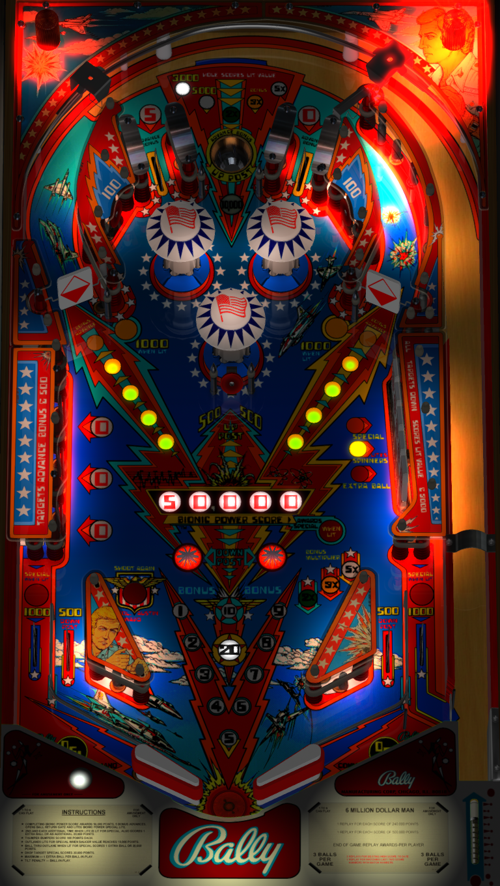

# Six Million Dollar Man, The (Bally 1978) Sound MOD

Author(s): [xenonph](https://www.vpforums.org/index.php?showuser=14100)  
Version:  Six Million Dollar Man, The (Bally 1978) Sound MOD v2.3.zip
Download:  [VP Forums](https://www.vpforums.org/index.php?app=downloads&showfile=12557)

DirectB2S
There are 2 DirectB2S included in the table download zip.
Six Million Dollar Man, The (Bally 1978) D-MOD v1.1.directb2s (Daytime Mod - Brighter backglass) **Techzombie's Preferred Choice**
Six Million Dollar Man, The (Bally 1978) N-MOD v1.1.directb2s (Night Mod - Darker backglass)
**Select only ONE For Your Preferred Choice**

ROM: smmanc.zip
Six Million Dollar Man (7-digit Rev3 Free Play) - ROM

Author(s): [destruk](https://www.vpforums.org/index.php?showuser=5)
Download:  [VP Forums](https://www.vpforums.org/index.php?app=downloads&showfile=5467)

Tested by:
[TechZombie]

## Status 

Minimum VPX Standalone build: 10.8.0-1983-b84441e
| Playfield | Controls | Backglass | DMD | ROM Required | FPS | 
|-----------|----------|-----------|-----|--------------|-----|
| :white_check_mark: | :white_check_mark: | :white_check_mark: | :x: | :white_check_mark: | 55 |

## Instructions

- Install this table through the Table Manager, using the `Add Table` > `Manual` page
- If you need help, more information found on the wiki: [TM - Add Table - Manual](https://github.com/LegendsUnchained/vpx-standalone-alp4k/wiki/%5B04%5D-%F0%9F%A7%A1-TM-%E2%80%90-Other-Features#add-table---manual)
- If the table requires any additional files/steps, click `GO TO TABLE` after adding, and the TM will open to the relevant table folder.
- Go fire up your Vpin and enjoy!
- "Gentlemen, we can rebuild him. We have the technology." ---Oscar Goldman

