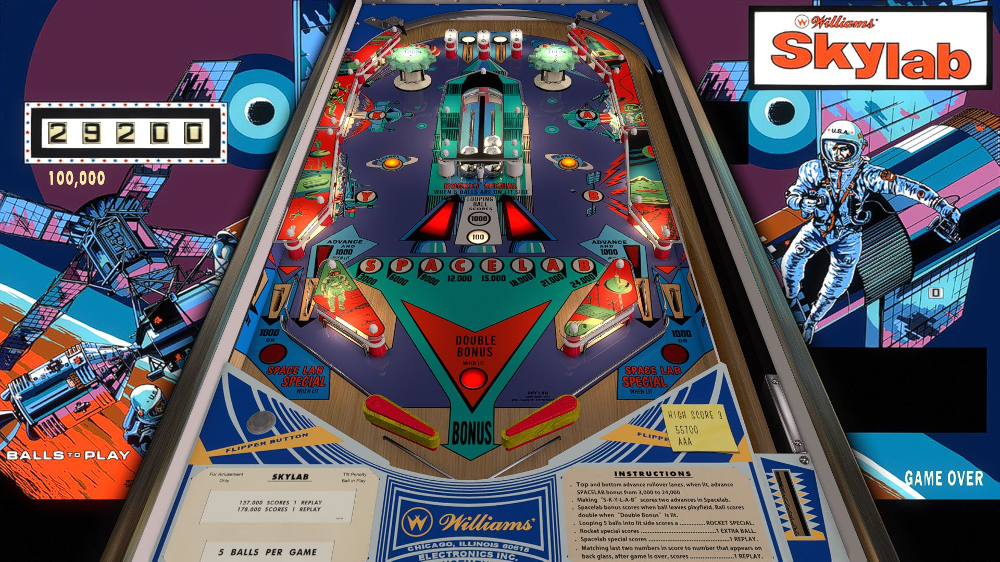

# Skylab (Williams 1974)

Authors: [klodo81](https://www.vpforums.org/index.php?showuser=44515)  
Version: 1.3  
Download: [VPForums](https://www.vpforums.org/index.php?app=downloads&showfile=18055)

DirectB2S

Authors: [hauntfreaks](https://vpuniverse.com/profile/5216-hauntfreaks/)  
Download: [VPUniverse](https://vpuniverse.com/files/file/17636-skylab-williams-1974-b2s/)

ROM

None

Tested by: evilwraith

## Status 

Minimum VPX Standalone build: 10.8.0-1989-a764013

| Playfield | Controls | Backglass | DMD | ROM Required | FPS | 
|-----------|----------|-----------|-----|--------------|-----|
| :white_check_mark: | :white_check_mark: | :white_check_mark: | :x: | :x: | 55 |

## Instructions

