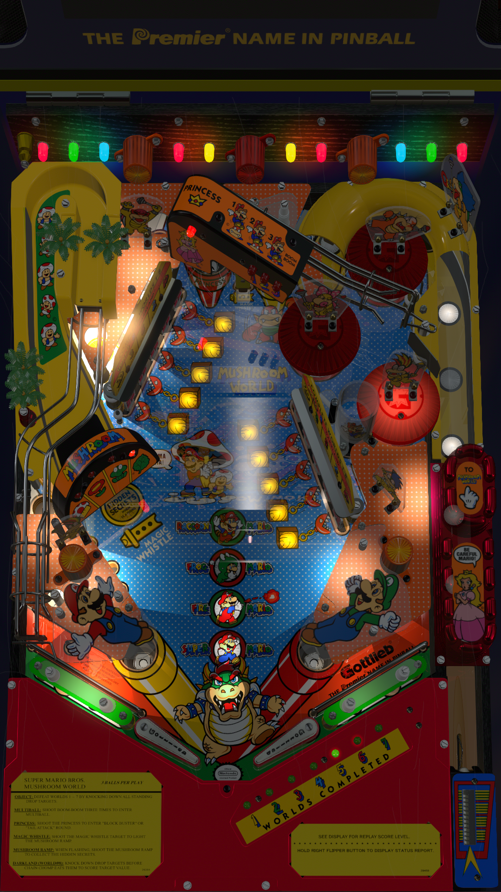

# Super Mario Bros. Mushroom World (Premier 1992)

Authors: [retro27](https://vpuniverse.com/profile/4085-retro27/)  
Version: 1.0.4i  
Download: [VP Universe](https://vpuniverse.com/files/file/20871-super-mario-bros-mushroom-world-premier-1992/)

DirectB2S

Authors: [hauntfreaks](https://vpuniverse.com/profile/5216-hauntfreaks/)  
Version: 1.0  
Download: [VP Universe](https://vpuniverse.com/files/file/18003-super-mario-brothers-mushroom-world-premier-1992-b2s-with-full-dmd/)

ROM

Download: [Pinball Nirvana](https://pinballnirvana.com/forums/resources/smbmush.2318/)

## Status 

Minimum VPX Standalone build: 10.8.0-1989-a764013
| Playfield | Controls | Backglass | DMD | ROM Required | FPS | 
|-----------|----------|-----------|-----|--------------|-----|
| :white_check_mark: | :white_check_mark: | :white_check_mark: | :white_check_mark: | :white_check_mark: | 45 |

## Instructions

- Install this table through the Table Manager, using the `Add Table` > `Manual` page
- If you need help, more information found on the wiki: [TM - Add Table - Manual](https://github.com/LegendsUnchained/vpx-standalone-alp4k/wiki/%5B04%5D-%F0%9F%A7%A1-TM-%E2%80%90-Other-Features#add-table---manual)
- If the table requires any additional files/steps, click `GO TO TABLE` after adding, and the TM will open to the relevant table folder.

