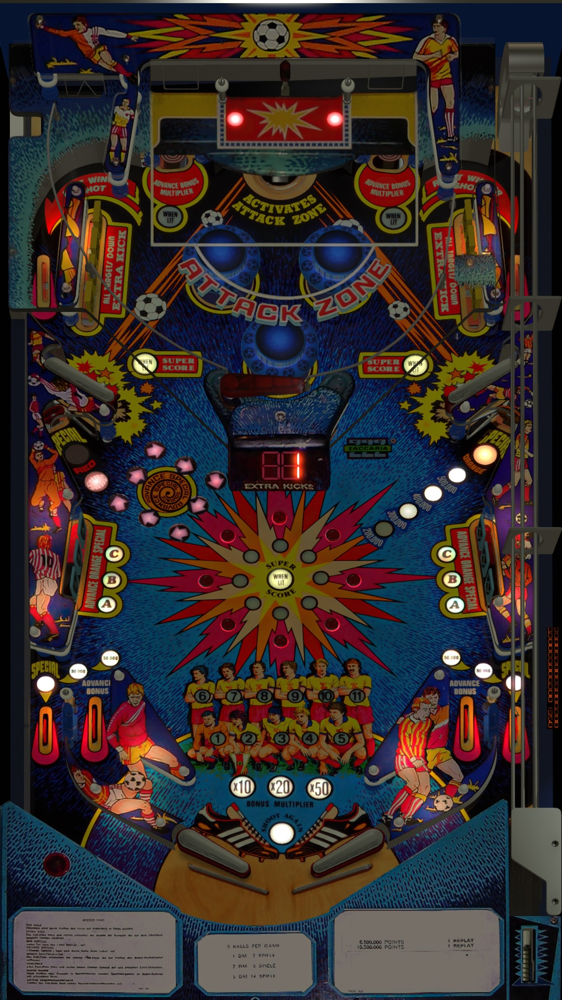

# Soccer Kings (Zaccaria 1982)

---

## Files
| File Type | Link | Version | Author | 
|-----------|--------|----------|--------------|
| **VPX** | [vpforums](https://www.vpforums.org/index.php?app=downloads&showfile=15437) | 1.0 | [goldchicco](https://www.vpforums.org/index.php?showuser=88795) |
| **B2S** | [vpforums](https://www.vpforums.org/index.php?app=downloads&showfile=9420) | 1.0 | [32assassin](https://www.vpforums.org/index.php?showuser=77712) |
| **ROM** | [vpforums](https://www.vpforums.org/index.php?app=downloads&showfile=600) | 1.0 | [destruk](https://www.vpforums.org/index.php?showuser=5) |

**Tested by:** [Ominous Osie]

---

## Status 
**Minimum VPX Standalone build:** 10.8.0-1431983
| Playfield | Controls | Backglass | DMD | ROM Required | FPS | 
|-----------|----------|-----------|-----|--------------|-----|
| :white_check_mark: | :white_check_mark: | :white_check_mark: | :x: | :white_check_mark: | 60 |

---

## Instructions

- Install this table through the Table Manager, using the `Add Table` > `Manual` page
- If you need help, more information found on the wiki: [TM - Add Table - Manual](https://github.com/LegendsUnchained/vpx-standalone-alp4k/wiki/%5B04%5D-%F0%9F%A7%A1-TM-%E2%80%90-Other-Features#add-table---manual)
- If the table requires any additional files/steps, click `GO TO TABLE` after adding, and the TM will open to the relevant table folder.

