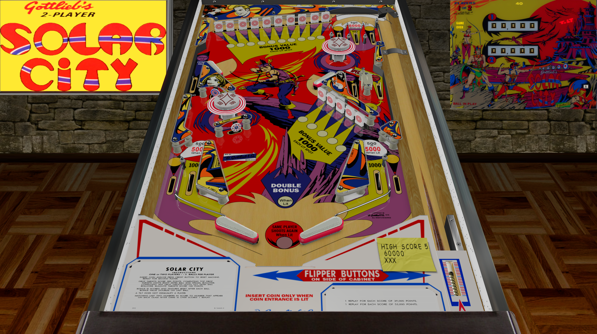

# solar City (Gottlieb 1976)

---

## Files
| File Type | Link | Version | Author | 
|-----------|--------|----------|--------------|
| **VPX** | [VPForums](https://www.vpforums.org/index.php?app=downloads&showfile=13680) | 1.0b | [loserman76](https://www.vpforums.org/index.php?showuser=41250) |
| **B2S** | included with table | 1.0b | [loserman76](https://www.vpforums.org/index.php?showuser=41250) |
| **DMD** | None | None | None |
| **ROM** | None | None | None |

**Tested by:** [Curt](https://github.com/Old-Cyrus)

---

## Status 
**Minimum VPX Standalone build:** 10.8.0-1989-a764013

| Playfield | Controls | Backglass | DMD | ROM Required | FPS | 
|-----------|----------|-----------|-----|--------------|-----|
| :white_check_mark: | :white_check_mark: | :white_check_mark: | :x: | :x: | 52 |

---

## Instructions

- Copy the contents of this repo folder to your USB drive
- Add your personalized launcher.elf and rename it to `vpx-solarcity.elf`
- Download the table and directb2s versions listed above, extract (if necessary) and copy them into `vpx-solarcity`
- Make sure `(.vpx)` `(.directb2s)` and `(.ini)` are all named the same.
