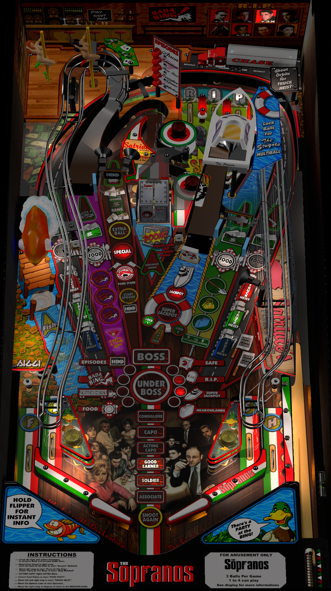

# The Sopranos Siggis Mod

Author: [Siggi](https://vpuniverse.com/profile/8779-siggi/)  

Tested by: Bla1ze

Version: 1.0.0  

Download: [VP Universe](https://vpuniverse.com/files/file/18652-the-sopranos-siggis-mod/)

DirectB2S

Author: [Ryguy417](https://vpuniverse.com/profile/31096-ryguy417/)  

Version: 2.0  

Download: [VP Universe](https://vpuniverse.com/files/file/12991-sopranos-stern-2005-b2s-with-full-dmd/)

ROM

Download: [VP Forums](https://www.vpforums.org/index.php?app=downloads&showfile=287)

SHA: 1f6965d6f7b350a3cab52bd843f63270b159f703
MD5:15ecf8c5a7cee365cad0be16ebbed414

## Status 

Minimum VPX Standalone build: 10.8.0-1989-a764013
| Playfield | Controls | Backglass | DMD | ROM Required | FPS | 
|-----------|----------|-----------|-----|--------------|-----|
| :white_check_mark: | :white_check_mark: | :white_check_mark: | :white_check_mark: | :white_check_mark: | 50|

## Instructions

- Copy the contents of this repo folder to your USB drive
- Add your personalized launcher.elf and rename it to vpx-sopranos.elf
- Download the table and directb2s versions listed above and copy them into this folder. The ROM zip gets copied to pinmame/roms (do not unzip).
- Party like you're at The Bing!
