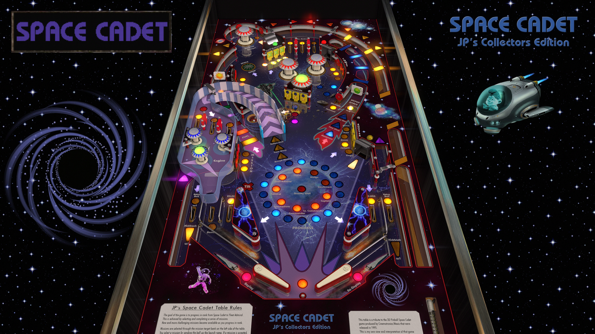

# JP's Space Cadet (Maxis 1995) (Original)
Tested by: kaoticBPR

Authors: [JPSalas](https://www.vpforums.org/index.php?showuser=277)  
Version: 5.7.0  
Download: [vpforums](https://www.vpforums.org/index.php?app=downloads&showfile=16091)

DirectB2S

Authors: [warclawz](https://vpuniverse.com/profile/63988-warclawz/)  
Version: 1.0.0  
Download: [VP Universe](https://vpuniverse.com/files/file/16601-space-cadet-original-maxis-1995-backglass-with-full-dmd/)

ROM

No Rom Required

## Status 

Minimum VPX Standalone build: 10.8.0-1989-a764013

| Playfield | Controls | Backglass | DMD | ROM Required | FPS | 
|-----------|----------|-----------|-----|--------------|-----|
| :white_check_mark: | :white_check_mark: | :white_check_mark: | :white_check_mark: | :x: | 60 |

## Instructions

- Install this table through the Table Manager, using the `Add Table` > `Manual` page
- If you need help, more information found on the wiki: [TM - Add Table - Manual](https://github.com/LegendsUnchained/vpx-standalone-alp4k/wiki/%5B04%5D-%F0%9F%A7%A1-TM-%E2%80%90-Other-Features#add-table---manual)
- If the table requires any additional files/steps, click `GO TO TABLE` after adding, and the TM will open to the relevant table folder.
- Relive Windows 95!

