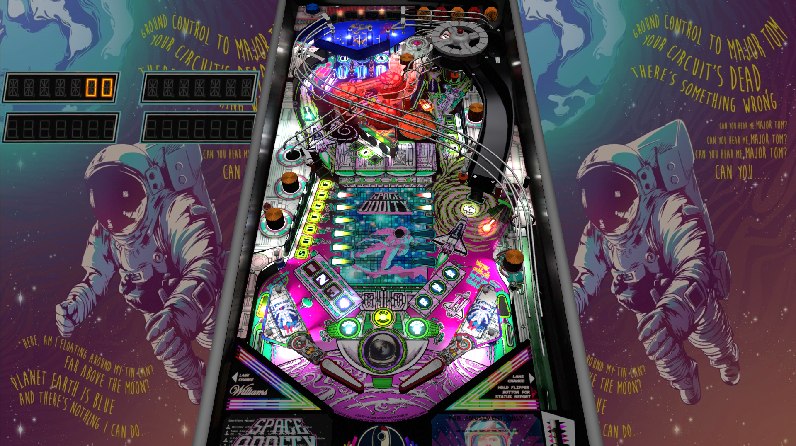

# Space Oddity (Original 2022)

Author: [balutito](https://vpuniverse.com/profile/36070-balutito/)  
Version: 1.3  
Download: [VP Universe](https://vpuniverse.com/files/file/10301-space-oditty/)

DirectB2S

Author: [balutito](https://vpuniverse.com/profile/36070-balutito/)  
Backglass Included with Table above  

ROM

Download: [vpforums](https://www.vpforums.org/index.php?app=downloads&showfile=906)  
ROM Name and version: spstn_l5.zip

Tested by:  
[psybocilin]

## Status 

Minimum VPX Standalone build: 10.8.0-1989-a764013

| Playfield | Controls | Backglass | DMD | ROM Required | FPS | 
|-----------|----------|-----------|-----|--------------|-----|
| :white_check_mark: | :white_check_mark: | :white_check_mark: | :x: | :white_check_mark: | 37 |

## Instructions

- Install this table through the Table Manager, using the `Add Table` > `Manual` page
- If you need help, more information found on the wiki: [TM - Add Table - Manual](https://github.com/LegendsUnchained/vpx-standalone-alp4k/wiki/%5B04%5D-%F0%9F%A7%A1-TM-%E2%80%90-Other-Features#add-table---manual)
- If the table requires any additional files/steps, click `GO TO TABLE` after adding, and the TM will open to the relevant table folder.
- Move folder "music" to vpx-spaceoddity so it looks like: external/vpx-spaceoddity/music
- "For here, am I sitting in a tin can, far above the world."

