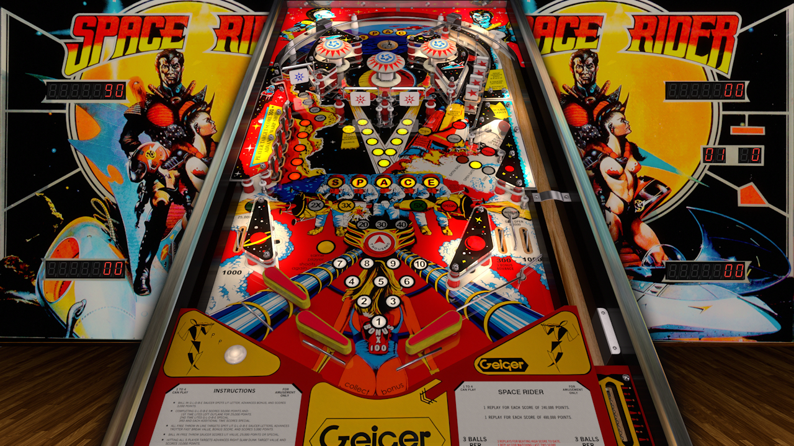

# Space Rider (Geiger 1980)

---

## Files
| File Type | Link | Version | Author | 
|-----------|--------|----------|--------------|
| **VPX** | [VPForums](https://www.vpforums.org/index.php?app=downloads&showfile=15649/) | 2.5.2 | [jpsalas](https://www.vpforums.org/index.php?showuser=277) |
| **B2S** | [VPUniverse](https://vpuniverse.com/files/file/2396-space-ridergeiger-1980/) | 2.0 | [Wildman](https://vpuniverse.com/profile/5-wildman/) |
| **ROM** | [VPForums](https://www.vpforums.org/index.php?app=downloads&showfile=695/) | hgbtrtb.zip |  | [destruk](https://www.vpforums.org/index.php?showuser=5) |
| **ROM** | [VPForums](https://www.vpforums.org/index.php?app=downloads&showfile=696/) | hgbtrtb.zip |  | [destruk](https://www.vpforums.org/index.php?showuser=5) |

**Tested by:** HereForGear

---

## Status 

Minimum VPX Standalone build: 10.8.0-1989-a764013
| Playfield | Controls | Backglass | DMD | ROM Required | FPS | 
|-----------|----------|-----------|-----|--------------|-----|
| :white_check_mark: | :white_check_mark: | :white_check_mark: | :x: | :white_check_mark: | 60 |

---

## Instructions

- Copy the contents of this repo folder to your USB drive
- Add your personalized launcher.elf and rename it to `vpx-spacerider.elf`
- Download the table and directb2s versions listed above, extract (if necessary) and copy them into `external/vpx-spacerider`
- This table uses 2 ROM files.
- Rom files (`.zip`) stay in zip folders, place both zip files in `vpx-spacerider/pinmame/roms`
- Make sure `(.vpx)` `(.direct2b2s)` `(.vbs)` and `(.ini)` are all named the same.
