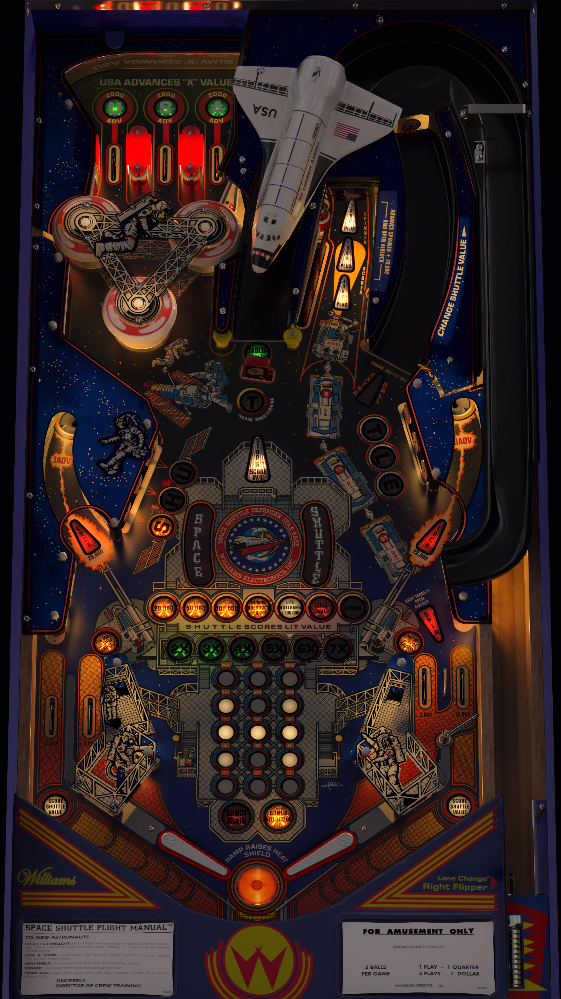

# Space Shuttle (Williams 1984)
Tested by: kaoticBPR

Authors: [bord](https://vpuniverse.com/profile/9265-bord/)  
Version: 2.0  
Download: [VPUniverse](https://vpuniverse.com/files/file/7492-space-shuttle-williams-1984/)

DirectB2S

Authors: [Wildman](https://vpuniverse.com/profile/5-wildman/)  
Version: 1.0.0  
Download: [VP Universe](https://vpuniverse.com/files/file/5715-space-shuttle-williams-1984/)

ROM

Download: [vpforums](https://www.vpforums.org/index.php?app=downloads&showfile=887)  
ROM Name and version: sshtl_l7.zip

## Status 

Minimum VPX Standalone build: 10.8.0-1989-a764013

| Playfield | Controls | Backglass | DMD | ROM Required | FPS | 
|-----------|----------|-----------|-----|--------------|-----|
| :white_check_mark: | :white_check_mark: | :white_check_mark: | :white_check_mark: | :white_check_mark: | 48 |

## Instructions

- Copy the contents of this repo folder to your USB drive
- Add your personalized launcher.elf and rename it to vpx-spaceshuttle.elf
- Download the table and directb2s versions listed above and copy them into this folder
- Make sure (.vpx), (.directb2s), (.ini) and (.vbs) files are all named the same. No need to rename the .dmd file.
- Place sshtl_l7.zip in the external/vpx-spaceshuttle/pinmame/roms folder. *Do Not unzip*!
- "It's time for take off."

