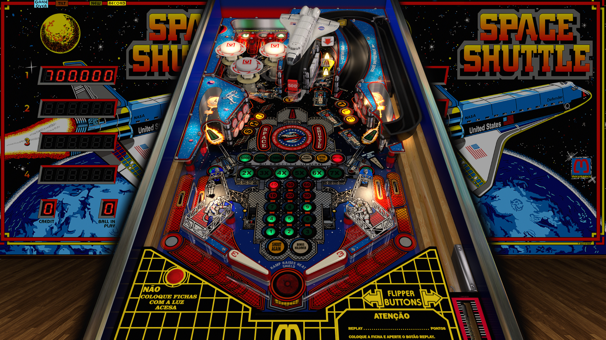

# Space Shuttle (Taito do Brasil 1982)

Author: [JPSalas](https://www.vpforums.org/index.php?showuser=277)  
Version: 5.5.0  
Download: [VP Forums](https://www.vpforums.org/index.php?app=downloads&showfile=13644)

DirectB2S

Author: [editoy](https://www.vpforums.org/index.php?showuser=80626)  
Version: 1.0  
Download: [VP Forums](https://www.vpforums.org/index.php?app=downloads&showfile=13653)

ROM

Download: [VP Forums](https://www.vpforums.org/index.php?app=downloads&showfile=585)  
MD5:fb816fc071bb7139ed18901fc6c275b0

Tested by: Boris

## Status 

Minimum VPX Standalone build: 10.8.0-1983-a764013

| Playfield | Controls | Backglass | DMD | ROM Required | FPS | 
|-----------|----------|-----------|-----|--------------|-----|
| :white_check_mark: | :white_check_mark: | :white_check_mark: | :x: | :white_check_mark: | 60 |

## Instructions

- "When I first looked back at the Earth, standing on the Moon, I cried." -Alan Shepard

