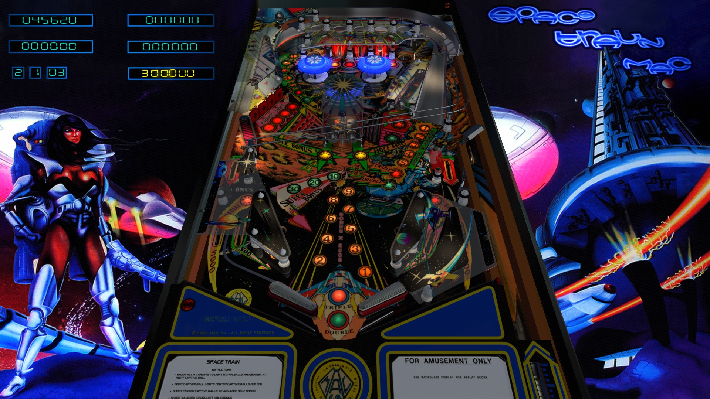

# Space Train Mac (MAC 1987)

---

## Files
| File Type | Link | Version | Author | 
|-----------|--------|----------|--------------|
| **VPX** | [VPForums](https://www.vpforums.org/index.php?app=downloads&showfile=15141) | 1.2a | [goldchicco](https://www.vpforums.org/index.php?app=core&module=search&do=user_activity&search_app=downloads&mid=88795) |
| **B2S** | [VPForums](https://www.vpforums.org/index.php?app=downloads&showfile=11765) | 1.0 | [mfuegemann](https://www.vpforums.org/index.php?showuser=5944) |
| **DMD** | Use 2-screen b2s | N/A | N/A |
| **ROM** | [VPForums](https://www.vpforums.org/index.php?app=downloads&showfile=9539) | ? | [Maguinas Automaticas Computerizadas, S.A. (MAC)](https://pinside.com/pinball/machine?query=&manufacturer[]=44#results) |

**Tested by:** [Curt](https://github.com/Old-Cyrus)

---

## Status

**Minimum VPX Standalone build:** 10.8.0-1989-a764013

| Playfield | Controls | Backglass | DMD | ROM Required | FPS | 
|-----------|----------|-----------|-----|--------------|-----|
| :white_check_mark: | :white_check_mark: | :white_check_mark: | :x: | :white_check_mark: | 60 |

---

## Instructions

