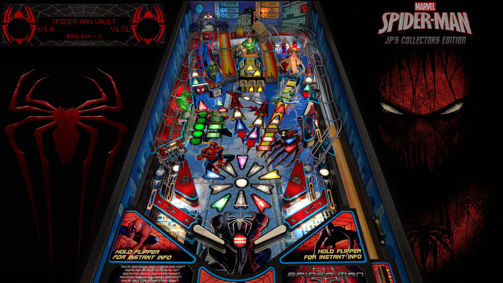

# JP's Spider-Man

Authors: [jpsalas](https://www.vpforums.org/index.php?s=543a5ca562cc33a89debe8ace8834f1e&showuser=277)  
Version: 5.0.0  
Download: [VP Forums](https://www.vpforums.org/index.php?app=downloads&showfile=13614)

DirectB2S

Authors: [hauntfreaks](https://vpuniverse.com/profile/5216-hauntfreaks/)  
Version: 1.5  
Download: [VP Universe](https://vpuniverse.com/files/file/13305-spider-man-stern-2007-alt-b2s-full-dmd/)

ROM

Download: [VP Universe](https://vpuniverse.com/files/file/4202-spider-man-vault-edition-v101/)

## Status 

Minimum VPX Standalone build: 10.8.0-1989-a764013
| Playfield | Controls | Backglass | DMD | ROM Required | FPS | 
|-----------|----------|-----------|-----|--------------|-----|
| :white_check_mark: | :white_check_mark: | :white_check_mark: | :white_check_mark: | :white_check_mark: | 60 |

## Instructions

- Make sure to use the Table Manager to install this table.
- Instructions can be found on the wiki [Add Table - Manual](https://github.com/LegendsUnchained/vpx-standalone-alp4k/wiki/%5B04%5D-%F0%9F%A7%A1-TM-%E2%80%90-Other-Features#add-table---manual)
- If the table requires any additional files/steps, click `GO TO TABLE` after adding, and the TM will open to the relevant table folder.

